# Laboratorio 0: Creación de clúster EMR

## Creación de bucket en S3

Como el clúster EMR guarda los cuadernos de Spark, toma datos de, y guarda sus
logs en un bucket de AWS S3, pues primero fui a crear ese bucket:

| Nombre | Región | URI |
|---|---|---|
| lmtorresv-datalake | us-east-1 | `s3://lmtorresv-datalake/` |

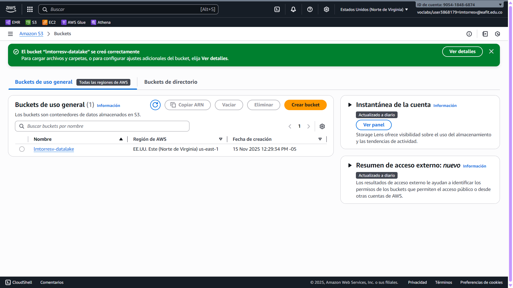

Además activé el acceso público al bucket S3 (o, mejor dicho, desactivé el
bloqueo público que impone por defecto AWS):

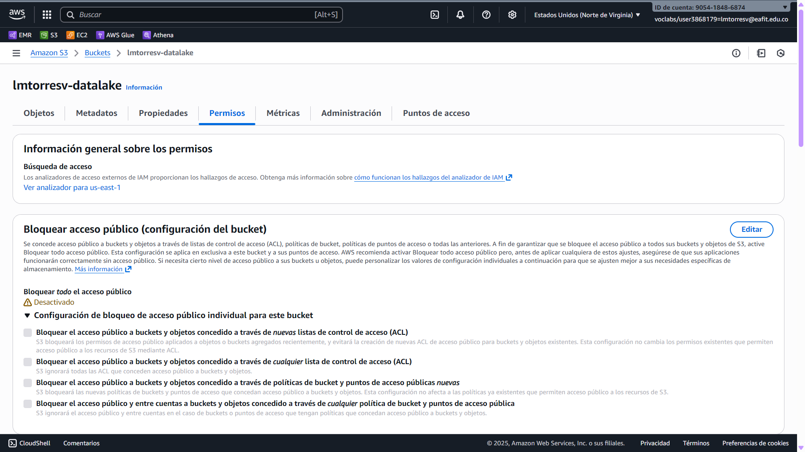

Ya tengo unos cuantos archivos creados — archivos que se necesitan luego al
crear el clúster EMR — que puedo ver listados si invoco AWS CLI sobre el
bucket S3:

```
$ aws s3 ls s3://lmtorresv-datalake/
                           PRE emr-cluster-logs/
2025-11-15 15:03:50        208 emr-cluster-config.json
2025-11-15 15:07:40        124 install-python-libs.sh
```

## Creación del clúster

### Lo esencial

Ahora sí fui a crear el clúster, apoyándome en recursos almacenados
en el bucket S3. Usé esta configuración:

- Versión de Amazon EMR: emr-7.10.0 (como en la guía)
- Paquete de aplicaciones: HCatalog, Hue, Livy, Zeppelin, Flink,
  Hadoop, JupyterEnterpriseGateway, Tez, Hive, JupyterHub, Spark
- Configuración del Catálogo de datos de AWS Glue:
  - [x] Usar para metadatos de la tabla de Hive
  - [x] Usar para metadatos de la tabla de Spark

> [!NOTE]
>
> Estas dos últimas configuraciones son necesarias para que luego al usar
> Hue podamos ver las tablas que maneja Hive. Si uno no las activa, luego
> sucede como en clase que no podíamos ver la tabla.

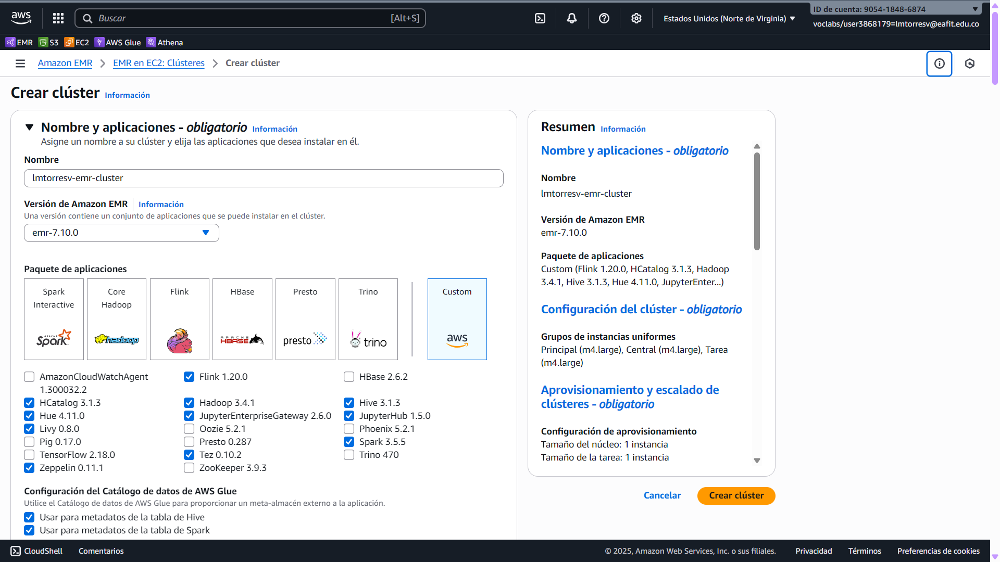

### Configuración de las instancias

Usé el tipo de instancia de EC2 `m4.large`, pues así lo sugería una guía de los
que hacen el laboratorio de AWS:

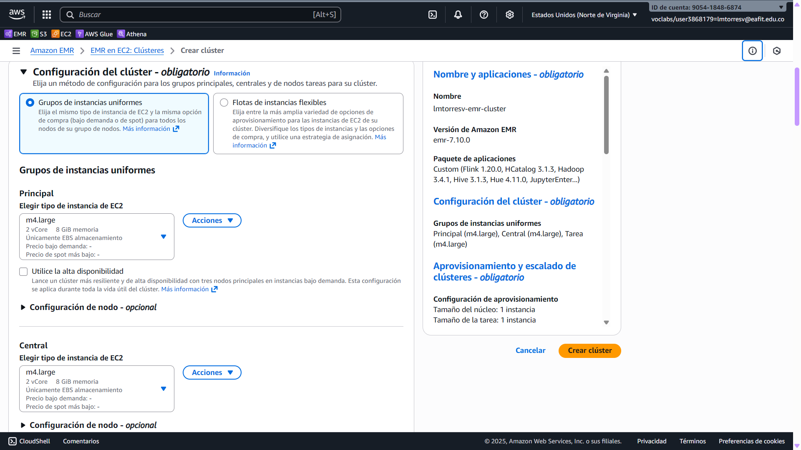

### Configuración de redes

Acá están los grupos de seguridad de EC2 administrados por EMR:

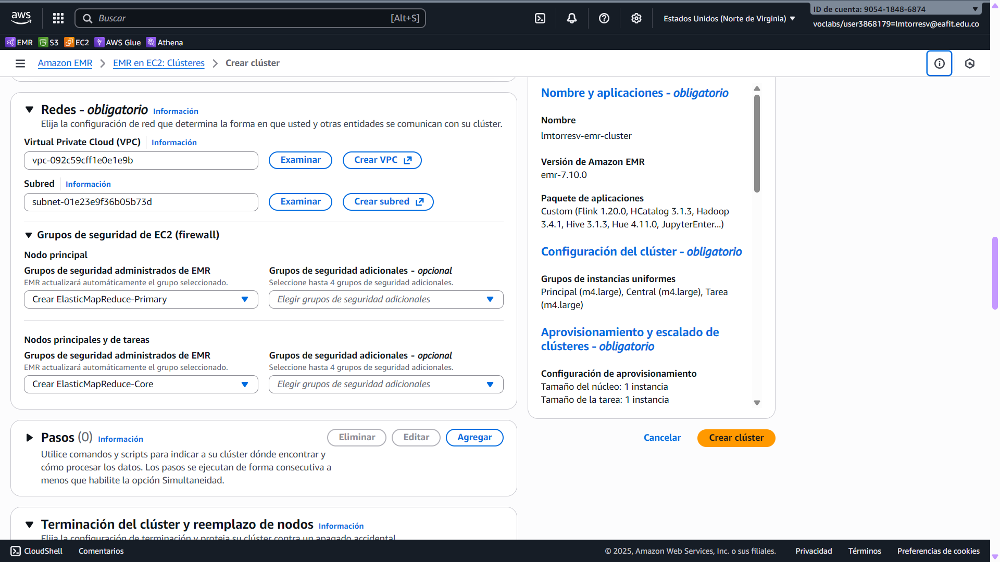

### Acciones de arranque (y logs)

Cargué el archivo [`install-python-libs.sh`](install-python-libs.sh) al bucket
S3 y lo configuré como acción de arranque. El enlace en Markdown debería llevar
a los contenidos de ese archivo en el repositorio.

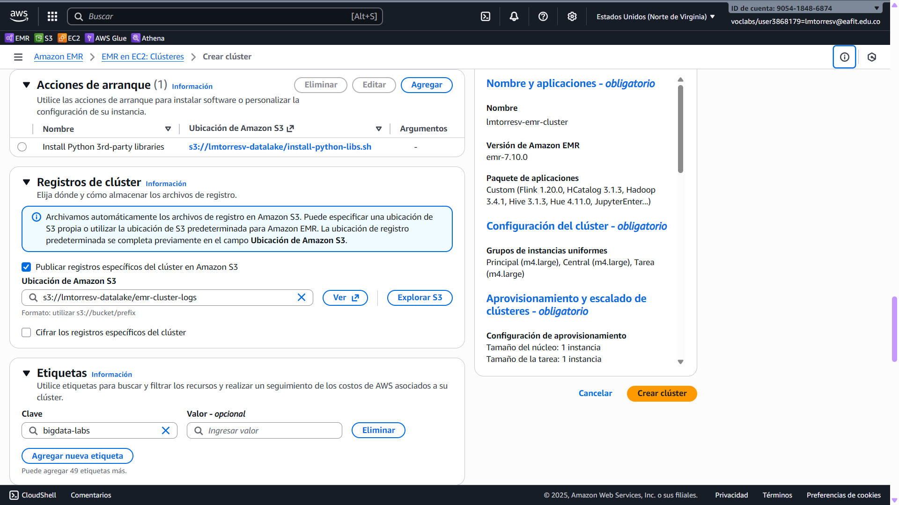

Además, creé un directorio (o «prefijo») en el bucket de S3 para guardar los
registros del clúster. No es súper importante, pero preferí tener todo en un
mismo sitio a que me creara más buckets.

### Configuración del software

Como explican
[en la documentación de AWS](https://docs.aws.amazon.com/emr/latest/ReleaseGuide/emr-jupyterhub-s3.html),
para tener persistencia de los _notebooks_ se puede configurar el clúster de
JupyterHub en Amazon EMR para que los guarde en AWS S3. Este es el ejemplo que
dan en esa página:

```json
[
    {
        "Classification": "jupyter-s3-conf",
        "Properties": {
            "s3.persistence.enabled": "true",
            "s3.persistence.bucket": "MyJupyterBackups"
        }
    }
]
```

Yo lo adapté en [`emr-cluster-config.json`](emr-cluster-config.json) con el
nombre de mi bucket y lo cargué a S3:

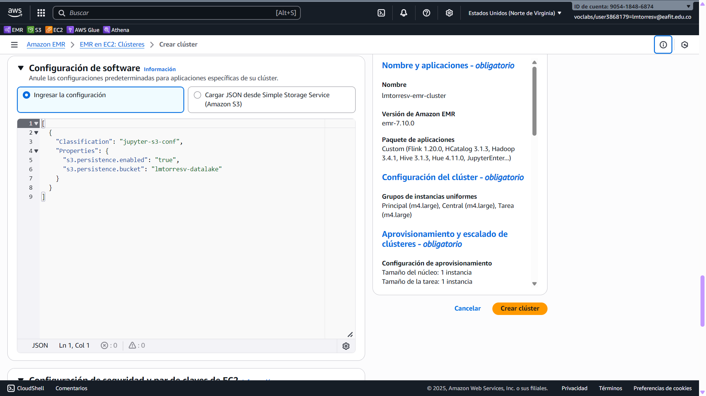

## Par de claves y roles

No hay mucho qué decir.

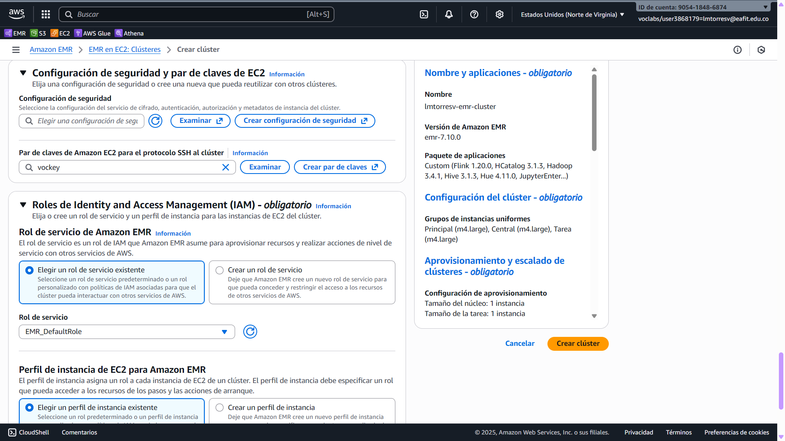
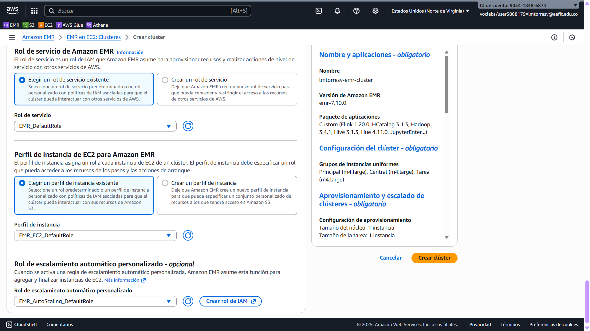

## Creación exitosa

Alrededor de 21 minutos después, el clúster estaba esperando órdenes:

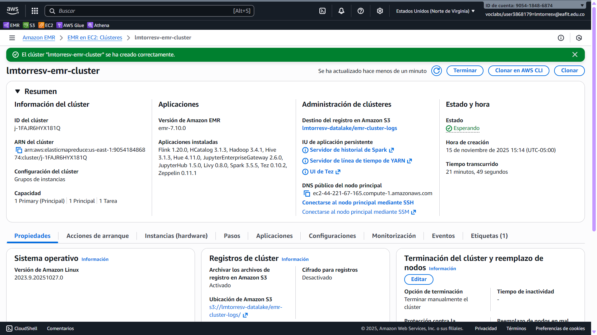

Si uno lo quisiera clonar con AWS CLI, puede usar los comandos en
[`aws-cli-create-cluster-script.bash`](aws-cli-create-cluster-script.bash):

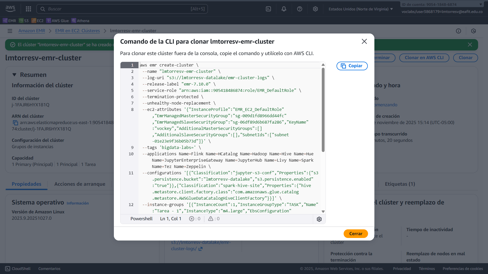

## Posconfiguración del clúster

### Activación de acceso público

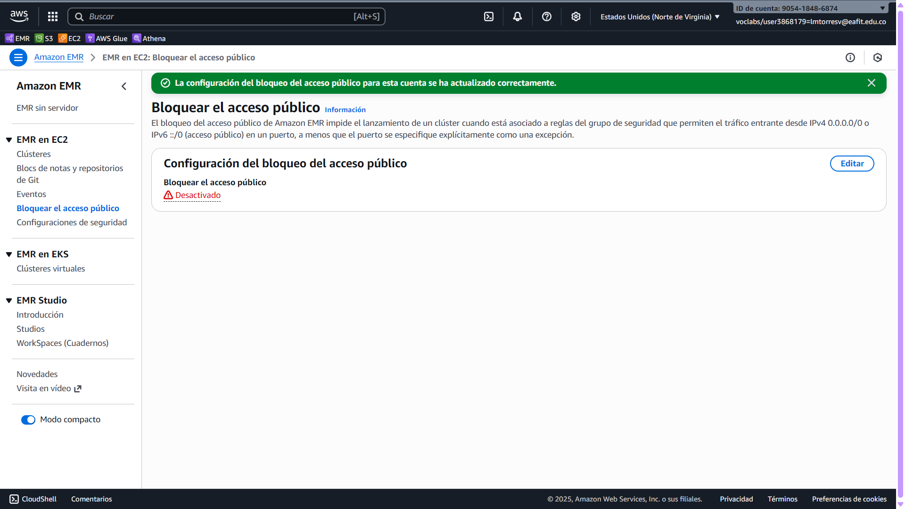

### Apertura de puertos

Abrí los siguientes puertos en el grupo de seguridad del nodo principal:

| Puerto  | Propósito |
|--:|--:|
| 22 | SSH |
| 8888 | Hue |
| 8890 |  Zeppelin |
| 9443 | JupyterHub |
| 9870 | HDFS Name Node |
| 14000 | No sé |

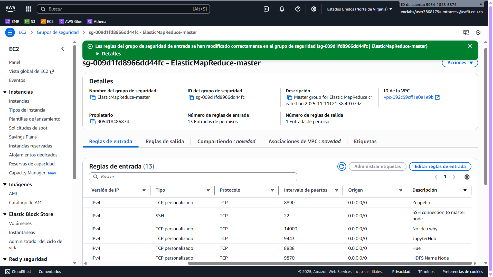

## Hue

Entré a la URL de la interfaz gráfica para Hue en el enlace que proporciona la
consola de AWS: <http://ec2-44-221-67-165.compute-1.amazonaws.com:8888/>

Configuré el usuario `hadoop` con una contraseña que no voy a publicar acá
porque tampoco estamos tan a nuestras anchas ;)

> [!NOTE]
>
> Nota por curiosidad y poco relevante:
> AWS en español le dice «Tonalidad» a Hue.

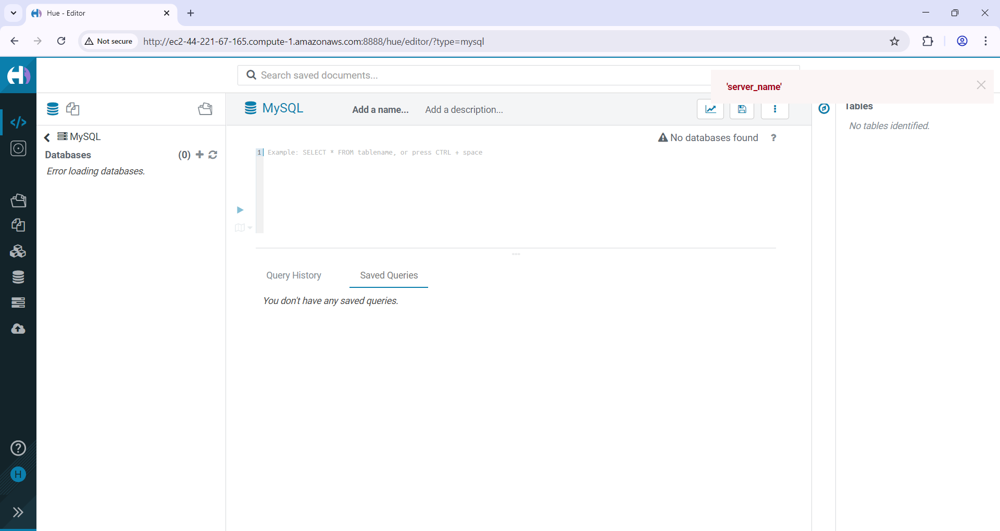

## JupyterHub

### Problema de las máquinas spot

Acá me pasó algo molesto. Entré a JupyterHub, creé un cuaderno nuevo, y corrí
la típica invocación de `spark`. Nada. Pasaron 5 minutos. 10 minutos. Nada.
Al rato devolvió un error:

```
The code failed because of a fatal error:
	Error sending http request and maximum retry encountered..

Some things to try:
a) Make sure Spark has enough available resources for Jupyter to create a Spark context.
b) Contact your Jupyter administrator to make sure the Spark magics library is configured correctly.
c) Restart the kernel.
```

Intenté reiniciar el kernel, pero ya nada respondía. Ni Hue, ni Hadoop. Nada.
Decidí reiniciar las instancias de EC2, porque quizá ese era el problema, y pude
volver a entrar. Solo que ahora el error era más grande:

<details>
<summary>
Error más grande (dar clic para expandir).
</summary>
<pre>
The code failed because of a fatal error:
	Session 0 unexpectedly reached final status 'dead'. See logs:
stdout:

stderr:
25/11/16 00:12:29 WARN NativeCodeLoader: Unable to load native-hadoop library for your platform... using builtin-java classes where applicable
25/11/16 00:12:30 INFO DefaultNoHARMFailoverProxyProvider: Connecting to ResourceManager at ip-172-31-71-203.ec2.internal/172.31.71.203:8032
25/11/16 00:12:32 INFO Configuration: resource-types.xml not found
25/11/16 00:12:32 INFO ResourceUtils: Unable to find 'resource-types.xml'.
25/11/16 00:12:32 INFO Client: Verifying our application has not requested more than the maximum memory capability of the cluster (6144 MB per container)
25/11/16 00:12:32 INFO Client: Will allocate AM container, with 1384 MB memory including 384 MB overhead
25/11/16 00:12:32 INFO Client: Setting up container launch context for our AM
25/11/16 00:12:32 INFO Client: Setting up the launch environment for our AM container
25/11/16 00:12:33 INFO Client: Preparing resources for our AM container
25/11/16 00:12:33 WARN Client: Failed to cleanup staging dir hdfs://ip-172-31-71-203.ec2.internal:8020/user/livy/.sparkStaging/application_1763251498199_0001
org.apache.hadoop.hdfs.server.namenode.SafeModeException: Cannot delete /user/livy/.sparkStaging/application_1763251498199_0001. Name node is in safe mode.
The reported blocks 0 needs additional 1338 blocks to reach the threshold 0.9990 of total blocks 1340.
The minimum number of live datanodes is not required. Safe mode will be turned off automatically once the thresholds have been reached. NamenodeHostName:ip-172-31-71-203.ec2.internal
	at org.apache.hadoop.hdfs.server.namenode.FSNamesystem.newSafemodeException(FSNamesystem.java:1679)
	at org.apache.hadoop.hdfs.server.namenode.FSNamesystem.checkNameNodeSafeMode(FSNamesystem.java:1666)
	at org.apache.hadoop.hdfs.server.namenode.FSNamesystem.delete(FSNamesystem.java:3405)
	at org.apache.hadoop.hdfs.server.namenode.NameNodeRpcServer.delete(NameNodeRpcServer.java:1144)
	at org.apache.hadoop.hdfs.protocolPB.ClientNamenodeProtocolServerSideTranslatorPB.delete(ClientNamenodeProtocolServerSideTranslatorPB.java:737)
	at org.apache.hadoop.hdfs.protocol.proto.ClientNamenodeProtocolProtos$ClientNamenodeProtocol$2.callBlockingMethod(ClientNamenodeProtocolProtos.java)
	at org.apache.hadoop.ipc.ProtobufRpcEngine2$Server$ProtoBufRpcInvoker.call(ProtobufRpcEngine2.java:621)
	at org.apache.hadoop.ipc.ProtobufRpcEngine2$Server$ProtoBufRpcInvoker.call(ProtobufRpcEngine2.java:589)
	at org.apache.hadoop.ipc.ProtobufRpcEngine2$Server$ProtoBufRpcInvoker.call(ProtobufRpcEngine2.java:573)
	at org.apache.hadoop.ipc.RPC$Server.call(RPC.java:1227)
	at org.apache.hadoop.ipc.Server$RpcCall.run(Server.java:1378)
	at org.apache.hadoop.ipc.Server$RpcCall.run(Server.java:1297)
	at java.base/java.security.AccessController.doPrivileged(AccessController.java:712)
	at java.base/javax.security.auth.Subject.doAs(Subject.java:439)
	at org.apache.hadoop.security.UserGroupInformation.doAs(UserGroupInformation.java:1953)
	at org.apache.hadoop.ipc.Server$Handler.run(Server.java:3538)

	at jdk.internal.reflect.NativeConstructorAccessorImpl.newInstance0(Native Method) ~[?:?]
	at jdk.internal.reflect.NativeConstructorAccessorImpl.newInstance(NativeConstructorAccessorImpl.java:77) ~[?:?]
	at jdk.internal.reflect.DelegatingConstructorAccessorImpl.newInstance(DelegatingConstructorAccessorImpl.java:45) ~[?:?]
	at java.lang.reflect.Constructor.newInstanceWithCaller(Constructor.java:500) ~[?:?]
	at java.lang.reflect.Constructor.newInstance(Constructor.java:481) ~[?:?]
	at org.apache.hadoop.ipc.RemoteException.instantiateException(RemoteException.java:121) ~[hadoop-client-api-3.4.1-amzn-2.jar:?]
	at org.apache.hadoop.ipc.RemoteException.unwrapRemoteException(RemoteException.java:88) ~[hadoop-client-api-3.4.1-amzn-2.jar:?]
	at org.apache.hadoop.hdfs.DFSClient.delete(DFSClient.java:1694) ~[hadoop-client-api-3.4.1-amzn-2.jar:?]
	at org.apache.hadoop.hdfs.DistributedFileSystem$19.doCall(DistributedFileSystem.java:1004) ~[hadoop-client-api-3.4.1-amzn-2.jar:?]
	at org.apache.hadoop.hdfs.DistributedFileSystem$19.doCall(DistributedFileSystem.java:1001) ~[hadoop-client-api-3.4.1-amzn-2.jar:?]
	at org.apache.hadoop.fs.FileSystemLinkResolver.resolve(FileSystemLinkResolver.java:81) ~[hadoop-client-api-3.4.1-amzn-2.jar:?]
	at org.apache.hadoop.hdfs.DistributedFileSystem.delete(DistributedFileSystem.java:1011) ~[hadoop-client-api-3.4.1-amzn-2.jar:?]
	at org.apache.spark.deploy.yarn.Client.cleanupStagingDirInternal$1(Client.scala:270) [spark-yarn_2.12-3.5.5-amzn-1.jar:3.5.5-amzn-1]
	at org.apache.spark.deploy.yarn.Client.cleanupStagingDir(Client.scala:279) [spark-yarn_2.12-3.5.5-amzn-1.jar:3.5.5-amzn-1]
	at org.apache.spark.deploy.yarn.Client.submitApplication(Client.scala:253) [spark-yarn_2.12-3.5.5-amzn-1.jar:3.5.5-amzn-1]
	at org.apache.spark.deploy.yarn.Client.run(Client.scala:1370) [spark-yarn_2.12-3.5.5-amzn-1.jar:3.5.5-amzn-1]
	at org.apache.spark.deploy.yarn.YarnClusterApplication.start(Client.scala:1818) [spark-yarn_2.12-3.5.5-amzn-1.jar:3.5.5-amzn-1]
	at org.apache.spark.deploy.SparkSubmit.org$apache$spark$deploy$SparkSubmit$$runMain(SparkSubmit.scala:1150) [spark-core_2.12-3.5.5-amzn-1.jar:3.5.5-amzn-1]
	at org.apache.spark.deploy.SparkSubmit.doRunMain$1(SparkSubmit.scala:200) [spark-core_2.12-3.5.5-amzn-1.jar:3.5.5-amzn-1]
	at org.apache.spark.deploy.SparkSubmit.submit(SparkSubmit.scala:223) [spark-core_2.12-3.5.5-amzn-1.jar:3.5.5-amzn-1]
	at org.apache.spark.deploy.SparkSubmit.doSubmit(SparkSubmit.scala:92) [spark-core_2.12-3.5.5-amzn-1.jar:3.5.5-amzn-1]
	at org.apache.spark.deploy.SparkSubmit$$anon$2.doSubmit(SparkSubmit.scala:1246) [spark-core_2.12-3.5.5-amzn-1.jar:3.5.5-amzn-1]
	at org.apache.spark.deploy.SparkSubmit$.main(SparkSubmit.scala:1255) [spark-core_2.12-3.5.5-amzn-1.jar:3.5.5-amzn-1]
	at org.apache.spark.deploy.SparkSubmit.main(SparkSubmit.scala) [spark-core_2.12-3.5.5-amzn-1.jar:3.5.5-amzn-1]
Caused by: org.apache.hadoop.ipc.RemoteException: Cannot delete /user/livy/.sparkStaging/application_1763251498199_0001. Name node is in safe mode.
The reported blocks 0 needs additional 1338 blocks to reach the threshold 0.9990 of total blocks 1340.
The minimum number of live datanodes is not required. Safe mode will be turned off automatically once the thresholds have been reached. NamenodeHostName:ip-172-31-71-203.ec2.internal
	at org.apache.hadoop.hdfs.server.namenode.FSNamesystem.newSafemodeException(FSNamesystem.java:1679)
	at org.apache.hadoop.hdfs.server.namenode.FSNamesystem.checkNameNodeSafeMode(FSNamesystem.java:1666)
	at org.apache.hadoop.hdfs.server.namenode.FSNamesystem.delete(FSNamesystem.java:3405)
	at org.apache.hadoop.hdfs.server.namenode.NameNodeRpcServer.delete(NameNodeRpcServer.java:1144)
	at org.apache.hadoop.hdfs.protocolPB.ClientNamenodeProtocolServerSideTranslatorPB.delete(ClientNamenodeProtocolServerSideTranslatorPB.java:737)
	at org.apache.hadoop.hdfs.protocol.proto.ClientNamenodeProtocolProtos$ClientNamenodeProtocol$2.callBlockingMethod(ClientNamenodeProtocolProtos.java)
	at org.apache.hadoop.ipc.ProtobufRpcEngine2$Server$ProtoBufRpcInvoker.call(ProtobufRpcEngine2.java:621)
	at org.apache.hadoop.ipc.ProtobufRpcEngine2$Server$ProtoBufRpcInvoker.call(ProtobufRpcEngine2.java:589)
	at org.apache.hadoop.ipc.ProtobufRpcEngine2$Server$ProtoBufRpcInvoker.call(ProtobufRpcEngine2.java:573)
	at org.apache.hadoop.ipc.RPC$Server.call(RPC.java:1227)
	at org.apache.hadoop.ipc.Server$RpcCall.run(Server.java:1378)
	at org.apache.hadoop.ipc.Server$RpcCall.run(Server.java:1297)
	at java.base/java.security.AccessController.doPrivileged(AccessController.java:712)
	at java.base/javax.security.auth.Subject.doAs(Subject.java:439)
	at org.apache.hadoop.security.UserGroupInformation.doAs(UserGroupInformation.java:1953)
	at org.apache.hadoop.ipc.Server$Handler.run(Server.java:3538)

	at org.apache.hadoop.ipc.Client.getRpcResponse(Client.java:1676) ~[hadoop-client-api-3.4.1-amzn-2.jar:?]
	at org.apache.hadoop.ipc.Client.call(Client.java:1621) ~[hadoop-client-api-3.4.1-amzn-2.jar:?]
	at org.apache.hadoop.ipc.Client.call(Client.java:1518) ~[hadoop-client-api-3.4.1-amzn-2.jar:?]
	at org.apache.hadoop.ipc.ProtobufRpcEngine2$Invoker.invoke(ProtobufRpcEngine2.java:258) ~[hadoop-client-api-3.4.1-amzn-2.jar:?]
	at org.apache.hadoop.ipc.ProtobufRpcEngine2$Invoker.invoke(ProtobufRpcEngine2.java:139) ~[hadoop-client-api-3.4.1-amzn-2.jar:?]
	at jdk.proxy2.$Proxy29.delete(Unknown Source) ~[?:?]
	at org.apache.hadoop.hdfs.protocolPB.ClientNamenodeProtocolTranslatorPB.lambda$delete$19(ClientNamenodeProtocolTranslatorPB.java:598) ~[hadoop-client-api-3.4.1-amzn-2.jar:?]
	at org.apache.hadoop.ipc.internal.ShadedProtobufHelper.ipc(ShadedProtobufHelper.java:160) ~[hadoop-client-api-3.4.1-amzn-2.jar:?]
	at org.apache.hadoop.hdfs.protocolPB.ClientNamenodeProtocolTranslatorPB.delete(ClientNamenodeProtocolTranslatorPB.java:598) ~[hadoop-client-api-3.4.1-amzn-2.jar:?]
	at jdk.internal.reflect.NativeMethodAccessorImpl.invoke0(Native Method) ~[?:?]
	at jdk.internal.reflect.NativeMethodAccessorImpl.invoke(NativeMethodAccessorImpl.java:77) ~[?:?]
	at jdk.internal.reflect.DelegatingMethodAccessorImpl.invoke(DelegatingMethodAccessorImpl.java:43) ~[?:?]
	at java.lang.reflect.Method.invoke(Method.java:569) ~[?:?]
	at org.apache.hadoop.io.retry.RetryInvocationHandler.invokeMethod(RetryInvocationHandler.java:437) ~[hadoop-client-api-3.4.1-amzn-2.jar:?]
	at org.apache.hadoop.io.retry.RetryInvocationHandler$Call.invokeMethod(RetryInvocationHandler.java:170) ~[hadoop-client-api-3.4.1-amzn-2.jar:?]
	at org.apache.hadoop.io.retry.RetryInvocationHandler$Call.invoke(RetryInvocationHandler.java:162) ~[hadoop-client-api-3.4.1-amzn-2.jar:?]
	at org.apache.hadoop.io.retry.RetryInvocationHandler$Call.invokeOnce(RetryInvocationHandler.java:100) ~[hadoop-client-api-3.4.1-amzn-2.jar:?]
	at org.apache.hadoop.io.retry.RetryInvocationHandler.invoke(RetryInvocationHandler.java:366) ~[hadoop-client-api-3.4.1-amzn-2.jar:?]
	at jdk.proxy2.$Proxy30.delete(Unknown Source) ~[?:?]
	at org.apache.hadoop.hdfs.DFSClient.delete(DFSClient.java:1692) ~[hadoop-client-api-3.4.1-amzn-2.jar:?]
	... 16 more
Exception in thread "main" org.apache.hadoop.hdfs.server.namenode.SafeModeException: Cannot create directory /user/livy/.sparkStaging/application_1763251498199_0001. Name node is in safe mode.
The reported blocks 0 needs additional 1338 blocks to reach the threshold 0.9990 of total blocks 1340.
The minimum number of live datanodes is not required. Safe mode will be turned off automatically once the thresholds have been reached. NamenodeHostName:ip-172-31-71-203.ec2.internal.

Some things to try:
a) Make sure Spark has enough available resources for Jupyter to create a Spark context.
b) Contact your Jupyter administrator to make sure the Spark magics library is configured correctly.
c) Restart the kernel.
</pre>
</details>

Resultó ser que, como había configurado las máquinas para que usaran el modelo
Spot, donde AWS puede retomarlas si las necesita, me había quitado varias
máquinas. O sea, tal cual no estaban corriendo y no podía hacer nada
al respecto, excepto esperar:

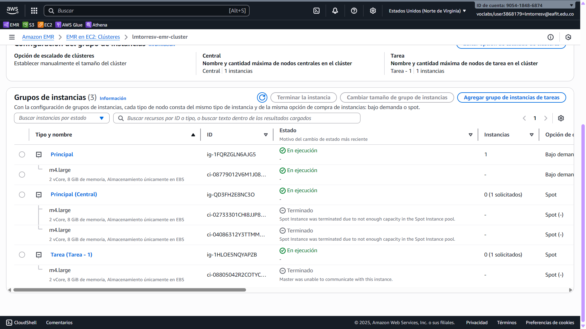

Opté por terminar el clúster y
[montar uno nuevo](aws-cli-create-nospotmachinesplease-cluster-script.bash)
pero sin el modelo de Spot:

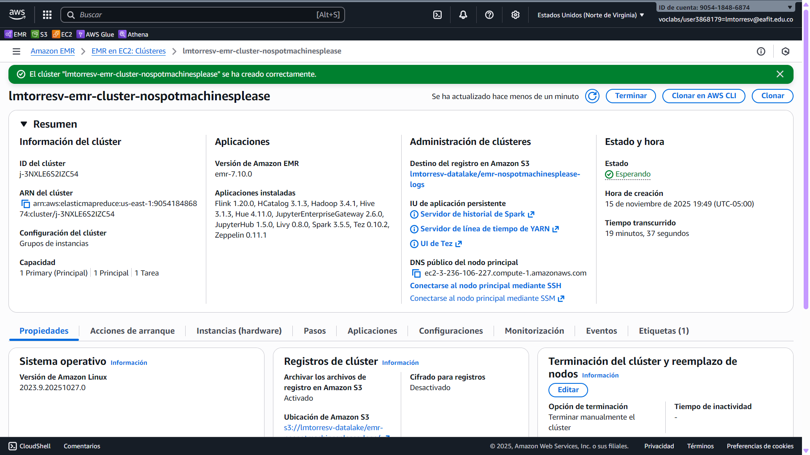

Seguí las instrucciones anteriores mías – menos mal lo fui documentando – y pude
crear otro clúster que, ojalá, no se caiga con el comando más simple.

### Por fin entrando a JupyterHub

Después de esperar a que se creara el clúster, entré a JupyterHub y por fin pude
correr el simple comando de Spark :)

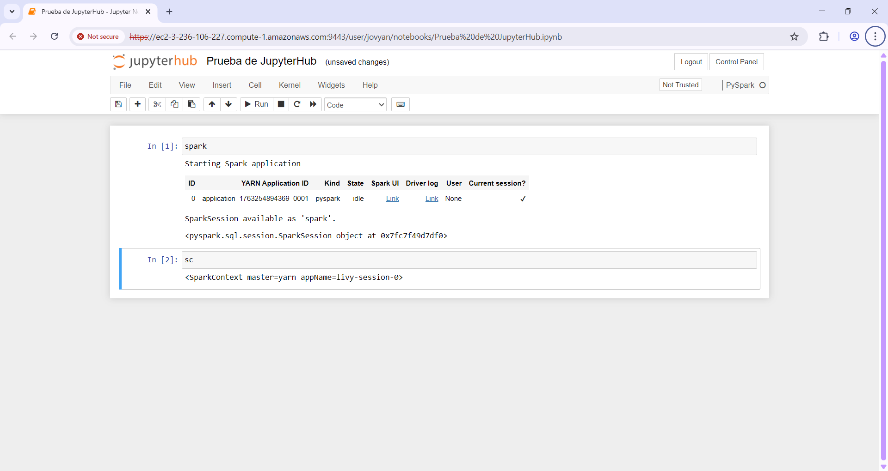

El _notebook_ de esto tan sencillo se encuentra en
[`notebooks/prueba-jupyterhub.ipynb`](notebooks/prueba-jupyterhub.ipynb).
