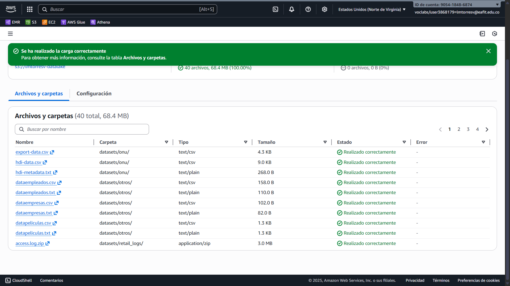
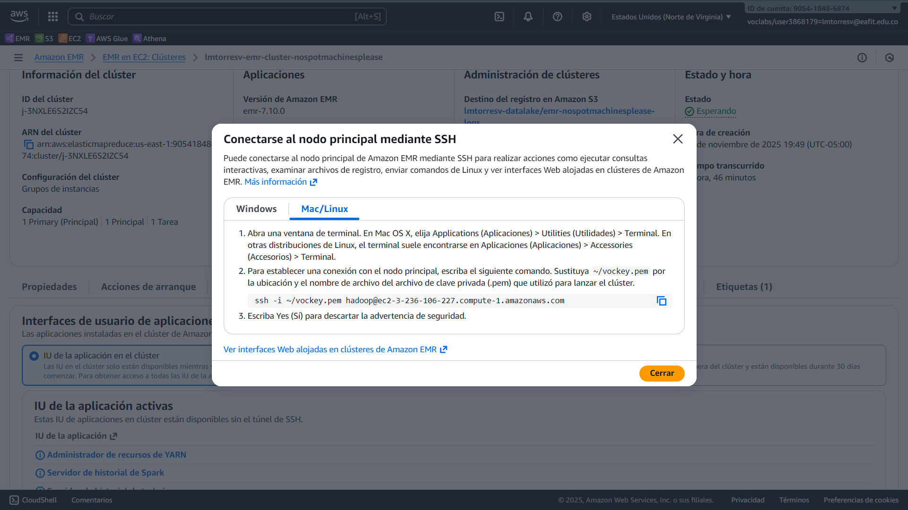

# Laboratorio 1: Interacción con el HDFS de Hadoop

## Preparación

### Cargar los datasets al bucket S3



## Conexión vía SSH

Me conecté al nodo principal mediante SSH:



> [!NOTE]
>
> La clave privada `vockey.pem` está en la página de inicio del laboratorio de
> AWS.

```
$ nvim ~/.ssh/vockey.pem
$ chmod 400 ~/.ssh/vockey.pem
$ ssh -i ~/.ssh/vockey.pem hadoop@ec2-3-236-106-227.compute-1.amazonaws.com
   ,     #_
   ~\_  ####_        Amazon Linux 2023
  ~~  \_#####\
  ~~     \###|
  ~~       \#/ ___   https://aws.amazon.com/linux/amazon-linux-2023
   ~~       V~' '->
    ~~~         /
      ~~._.   _/
         _/ _/
       _/m/'
Last login: Sun Nov 16 02:30:19 2025

EEEEEEEEEEEEEEEEEEEE MMMMMMMM           MMMMMMMM RRRRRRRRRRRRRRR
E::::::::::::::::::E M:::::::M         M:::::::M R::::::::::::::R
EE:::::EEEEEEEEE:::E M::::::::M       M::::::::M R:::::RRRRRR:::::R
  E::::E       EEEEE M:::::::::M     M:::::::::M RR::::R      R::::R
  E::::E             M::::::M:::M   M:::M::::::M   R:::R      R::::R
  E:::::EEEEEEEEEE   M:::::M M:::M M:::M M:::::M   R:::RRRRRR:::::R
  E::::::::::::::E   M:::::M  M:::M:::M  M:::::M   R:::::::::::RR
  E:::::EEEEEEEEEE   M:::::M   M:::::M   M:::::M   R:::RRRRRR::::R
  E::::E             M:::::M    M:::M    M:::::M   R:::R      R::::R
  E::::E       EEEEE M:::::M     MMM     M:::::M   R:::R      R::::R
EE:::::EEEEEEEE::::E M:::::M             M:::::M   R:::R      R::::R
E::::::::::::::::::E M:::::M             M:::::M RR::::R      R::::R
EEEEEEEEEEEEEEEEEEEE MMMMMMM             MMMMMMM RRRRRRR      RRRRRR

[hadoop@ip-172-31-74-184 ~]$
```

## Comandos para listar archivos

### Listar la raíz

```
[hadoop@ip-172-31-74-184 st0263]$ hdfs dfs -ls /
Found 4 items
drwxr-xr-x   - hdfs hdfsadmingroup          0 2025-11-16 01:01 /apps
drwxrwxrwt   - hdfs hdfsadmingroup          0 2025-11-16 01:02 /tmp
drwxr-xr-x   - hdfs hdfsadmingroup          0 2025-11-16 01:01 /user
drwxr-xr-x   - hdfs hdfsadmingroup          0 2025-11-16 01:01 /var
```

### Listar los directorios de usuarios

```
[hadoop@ip-172-31-74-184 st0263]$ hdfs dfs -ls /user
Found 9 items
drwxrwxrwx   - hadoop   hdfsadmingroup          0 2025-11-16 02:56 /user/hadoop
drwxr-xr-x   - mapred   mapred                  0 2025-11-16 01:01 /user/history
drwxrwxrwx   - hdfs     hdfsadmingroup          0 2025-11-16 01:01 /user/hive
drwxrwxrwx   - hue      hue                     0 2025-11-16 01:01 /user/hue
drwxrwxrwx   - livy     livy                    0 2025-11-16 01:17 /user/livy
drwxrwxrwx   - oozie    oozie                   0 2025-11-16 01:01 /user/oozie
drwxrwxrwx   - root     hdfsadmingroup          0 2025-11-16 01:01 /user/root
drwxrwxrwx   - spark    spark                   0 2025-11-16 01:01 /user/spark
drwxrwxrwx   - zeppelin hdfsadmingroup          0 2025-11-16 01:01 /user/zeppelin
```

### Listar el directorio del usuario `hadoop`

```
[hadoop@ip-172-31-74-184 st0263]$ hdfs dfs -ls /user/hadoop
Found 1 items
drwxr-xr-x   - hadoop hdfsadmingroup          0 2025-11-16 02:56 /user/hadoop/datasets
```

### Listar el directorio no existente (todavía) de `datasets`

```
[hadoop@ip-172-31-74-184 st0263]$ hdfs dfs -ls /user/hadoop/datasets
ls: `/user/hadoop/datasets': No such file or directory
[hadoop@ip-172-31-74-184 st0263]$
```

## Crear directorio de datasets

```
[hadoop@ip-172-31-74-184 st0263]$ hdfs dfs -mkdir /user/hadoop/datasets
[hadoop@ip-172-31-74-184 st0263]$
```

## Clonar el repositorio

```
[hadoop@ip-172-31-79-60 ~]$ git clone https://github.com/luismtorresv/st0263.git
Cloning into 'st0263'...
remote: Enumerating objects: 400, done.
remote: Counting objects: 100% (119/119), done.
remote: Compressing objects: 100% (61/61), done.
remote: Total 400 (delta 71), reused 99 (delta 58), pack-reused 281 (from 1)
Receiving objects: 100% (400/400), 37.56 MiB | 38.35 MiB/s, done.
Resolving deltas: 100% (171/171), done.
```

> [!NOTE]
>
> Creé un fork del repositorio. Por eso usa mi cuenta.
>
> Además, moví `datasets` a la raíz (junto con otros cambios).

## Copiar `gutenberg-small` al HDFS

Copié los archivos usando `put`:

```
[hadoop@ip-172-31-79-60 ~]$ hdfs dfs -put ~/st0263/datasets/gutenberg-small/*.txt /user/hadoop/datasets/gutenberg-small
```

Verifiqué que existan en HDFS con `ls`:

```
[hadoop@ip-172-31-79-60 ~]$ hdfs dfs -ls /user/hadoop/datasets/gutenberg-small
Found 16 items
-rw-r--r--   1 hadoop hdfsadmingroup       5717 2025-11-16 16:11 /user/hadoop/datasets/gutenberg-small/AbrahamLincoln___LincolnLetters.txt
-rw-r--r--   1 hadoop hdfsadmingroup      21208 2025-11-16 16:11 /user/hadoop/datasets/gutenberg-small/AbrahamLincoln___LincolnsFirstInauguralAddress.txt
-rw-r--r--   1 hadoop hdfsadmingroup       1618 2025-11-16 16:11 /user/hadoop/datasets/gutenberg-small/AbrahamLincoln___LincolnsGettysburgAddressGivenNovember-19-1863.txt
-rw-r--r--   1 hadoop hdfsadmingroup     257455 2025-11-16 16:11 /user/hadoop/datasets/gutenberg-small/AbrahamLincoln___LincolnsInauguralsAddressesandLettersSelections.txt
-rw-r--r--   1 hadoop hdfsadmingroup       4020 2025-11-16 16:11 /user/hadoop/datasets/gutenberg-small/AbrahamLincoln___LincolnsSecondInauguralAddress.txt
-rw-r--r--   1 hadoop hdfsadmingroup     507462 2025-11-16 16:11 /user/hadoop/datasets/gutenberg-small/AbrahamLincoln___SpeechesandLettersofAbrahamLincoln1832-1865.txt
-rw-r--r--   1 hadoop hdfsadmingroup     165030 2025-11-16 16:11 /user/hadoop/datasets/gutenberg-small/AbrahamLincoln___StateoftheUnionAddresses.txt
-rw-r--r--   1 hadoop hdfsadmingroup       3848 2025-11-16 16:11 /user/hadoop/datasets/gutenberg-small/AbrahamLincoln___TheEmancipationProclamation.txt
-rw-r--r--   1 hadoop hdfsadmingroup      44772 2025-11-16 16:11 /user/hadoop/datasets/gutenberg-small/AbrahamLincoln___TheLifeandPublicServiceofGeneralZacharyTaylorAnAddress.txt
-rw-r--r--   1 hadoop hdfsadmingroup     451186 2025-11-16 16:11 /user/hadoop/datasets/gutenberg-small/AbrahamLincoln___TheWritingsofAbrahamLincolnVolume1.txt
-rw-r--r--   1 hadoop hdfsadmingroup     496055 2025-11-16 16:11 /user/hadoop/datasets/gutenberg-small/AbrahamLincoln___TheWritingsofAbrahamLincolnVolume2.txt
-rw-r--r--   1 hadoop hdfsadmingroup     250854 2025-11-16 16:11 /user/hadoop/datasets/gutenberg-small/AbrahamLincoln___TheWritingsofAbrahamLincolnVolume3.txt
-rw-r--r--   1 hadoop hdfsadmingroup     206449 2025-11-16 16:11 /user/hadoop/datasets/gutenberg-small/AbrahamLincoln___TheWritingsofAbrahamLincolnVolume4.txt
-rw-r--r--   1 hadoop hdfsadmingroup     677845 2025-11-16 16:11 /user/hadoop/datasets/gutenberg-small/AbrahamLincoln___TheWritingsofAbrahamLincolnVolume5.txt
-rw-r--r--   1 hadoop hdfsadmingroup     584975 2025-11-16 16:11 /user/hadoop/datasets/gutenberg-small/AbrahamLincoln___TheWritingsofAbrahamLincolnVolume6.txt
-rw-r--r--   1 hadoop hdfsadmingroup     466500 2025-11-16 16:11 /user/hadoop/datasets/gutenberg-small/AbrahamLincoln___TheWritingsofAbrahamLincolnVolume7.txt
```

## Copiar los datasets desde S3

Usé `distcp` para copiar `datasets/airlines.csv` desde mi bucket:

```
[hadoop@ip-172-31-79-60 ~]$ hadoop distcp s3://lmtorresv-datalake/datasets/airlines.csv /tmp/
2025-11-16 16:15:58,489 INFO tools.DistCp: Input Options: DistCpOptions{atomicCommit=false, syncFolder=false, deleteMissing=false, ignoreFailures=false, overwrite=false, append=false, useDiff=false, useRdiff=false, fromSnapshot=null, toSnapshot=null, skipCRC=false, blocking=true, numListstatusThreads=0, maxMaps=20, mapBandwidth=0.0, copyStrategy='uniformsize', preserveStatus=[], atomicWorkPath=null, logPath=null, sourceFileListing=null, sourcePaths=[s3://lmtorresv-datalake/datasets/airlines.csv], targetPath=/tmp, filtersFile='null', blocksPerChunk=0, copyBufferSize=8192, verboseLog=false, directWrite=false, useiterator=false, updateRoot=false}, sourcePaths=[s3://lmtorresv-datalake/datasets/airlines.csv], targetPathExists=true, preserveRawXattrs=false
2025-11-16 16:15:58,731 INFO client.DefaultNoHARMFailoverProxyProvider: Connecting to ResourceManager at ip-172-31-79-60.ec2.internal/172.31.79.60:8032
2025-11-16 16:15:58,859 INFO client.AHSProxy: Connecting to Application History server at ip-172-31-79-60.ec2.internal/172.31.79.60:10200
2025-11-16 16:15:59,036 INFO s3a.EMRFSToS3AConfigMapping: Mapping EMRFS config fs.s3.sts.endpoint to S3A config fs.s3a.assumed.role.sts.endpoint
2025-11-16 16:15:59,036 INFO s3a.EMRFSToS3AConfigMapping: Mapping EMRFS config fs.s3.buffer.dir to S3A config fs.s3a.buffer.dir
2025-11-16 16:15:59,128 INFO impl.MetricsConfig: Loaded properties from hadoop-metrics2.properties
2025-11-16 16:15:59,221 INFO impl.MetricsSystemImpl: Scheduled Metric snapshot period at 300 second(s).
2025-11-16 16:15:59,221 INFO impl.MetricsSystemImpl: s3a-file-system metrics system started
2025-11-16 16:16:01,065 INFO tools.SimpleCopyListing: Starting: Building listing using multi threaded approach for s3://lmtorresv-datalake/datasets
2025-11-16 16:16:01,067 INFO tools.SimpleCopyListing: Building listing using multi threaded approach for s3://lmtorresv-datalake/datasets: duration 0:00.001s
2025-11-16 16:16:01,158 INFO tools.SimpleCopyListing: Paths (files+dirs) cnt = 1; dirCnt = 0
2025-11-16 16:16:01,158 INFO tools.SimpleCopyListing: Build file listing completed.
2025-11-16 16:16:01,159 INFO Configuration.deprecation: io.sort.mb is deprecated. Instead, use mapreduce.task.io.sort.mb
2025-11-16 16:16:01,160 INFO Configuration.deprecation: io.sort.factor is deprecated. Instead, use mapreduce.task.io.sort.factor
2025-11-16 16:16:01,247 INFO tools.DistCp: Number of paths in the copy list: 1
2025-11-16 16:16:01,280 INFO tools.DistCp: Number of paths in the copy list: 1
2025-11-16 16:16:01,326 INFO client.DefaultNoHARMFailoverProxyProvider: Connecting to ResourceManager at ip-172-31-79-60.ec2.internal/172.31.79.60:8032
2025-11-16 16:16:01,326 INFO client.AHSProxy: Connecting to Application History server at ip-172-31-79-60.ec2.internal/172.31.79.60:10200
2025-11-16 16:16:01,462 INFO mapreduce.JobResourceUploader: Disabling Erasure Coding for path: /tmp/hadoop-yarn/staging/hadoop/.staging/job_1763307644791_0002
2025-11-16 16:16:01,565 INFO mapreduce.JobSubmitter: number of splits:1
2025-11-16 16:16:01,774 INFO mapreduce.JobSubmitter: Submitting tokens for job: job_1763307644791_0002
2025-11-16 16:16:01,774 INFO mapreduce.JobSubmitter: Executing with tokens: []
2025-11-16 16:16:01,958 INFO conf.Configuration: resource-types.xml not found
2025-11-16 16:16:01,958 INFO resource.ResourceUtils: Unable to find 'resource-types.xml'.
2025-11-16 16:16:02,067 INFO impl.YarnClientImpl: Submitted application application_1763307644791_0002
2025-11-16 16:16:02,101 INFO mapreduce.Job: The url to track the job: http://ip-172-31-79-60.ec2.internal:20888/proxy/application_1763307644791_0002/
2025-11-16 16:16:02,101 INFO tools.DistCp: DistCp job-id: job_1763307644791_0002
2025-11-16 16:16:02,101 INFO mapreduce.Job: Running job: job_1763307644791_0002
2025-11-16 16:16:08,187 INFO mapreduce.Job: Job job_1763307644791_0002 running in uber mode : false
2025-11-16 16:16:08,188 INFO mapreduce.Job:  map 0% reduce 0%
2025-11-16 16:16:15,255 INFO mapreduce.Job:  map 100% reduce 0%
2025-11-16 16:16:15,264 INFO mapreduce.Job: Job job_1763307644791_0002 completed successfully
2025-11-16 16:16:15,338 INFO mapreduce.Job: Counters: 42
        File System Counters
                FILE: Number of bytes read=0
                FILE: Number of bytes written=329744
                FILE: Number of read operations=0
                FILE: Number of large read operations=0
                FILE: Number of write operations=0
                HDFS: Number of bytes read=395
                HDFS: Number of bytes written=780058
                HDFS: Number of read operations=12
                HDFS: Number of large read operations=0
                HDFS: Number of write operations=5
                HDFS: Number of bytes read erasure-coded=0
                S3: Number of bytes read=780058
                S3: Number of bytes written=0
                S3: Number of read operations=1
                S3: Number of large read operations=0
                S3: Number of write operations=0
        Job Counters
                Launched map tasks=1
                Other local map tasks=1
                Total time spent by all maps in occupied slots (ms)=7119360
                Total time spent by all reduces in occupied slots (ms)=0
                Total time spent by all map tasks (ms)=4635
                Total vcore-milliseconds taken by all map tasks=4635
                Total megabyte-milliseconds taken by all map tasks=7119360
        Map-Reduce Framework
                Map input records=1
                Map output records=0
                Input split bytes=137
                Spilled Records=0
                Failed Shuffles=0
                Merged Map outputs=0
                GC time elapsed (ms)=31
                CPU time spent (ms)=3560
                Physical memory (bytes) snapshot=383815680
                Virtual memory (bytes) snapshot=3208278016
                Total committed heap usage (bytes)=264241152
                Peak Map Physical memory (bytes)=383815680
                Peak Map Virtual memory (bytes)=3208278016
        File Input Format Counters
                Bytes Read=258
        File Output Format Counters
                Bytes Written=0
        DistCp Counters
                Bandwidth in Bytes=780058
                Bytes Copied=780058
                Bytes Expected=780058
                Files Copied=1
2025-11-16 16:16:15,348 INFO impl.MetricsSystemImpl: Stopping s3a-file-system metrics system...
2025-11-16 16:16:15,348 INFO impl.MetricsSystemImpl: s3a-file-system metrics system stopped.
2025-11-16 16:16:15,348 INFO impl.MetricsSystemImpl: s3a-file-system metrics system shutdown complete.
```

Verifiqué que los archivos estuvieran en `/tmp`:

```
[hadoop@ip-172-31-79-60 ~]$ hdfs dfs -ls /tmp/
Found 4 items
-rw-r--r--   1 hadoop hdfsadmingroup     780058 2025-11-16 16:16 /tmp/airlines.csv
drwxrwxrwt   - yarn   hdfsadmingroup          0 2025-11-16 15:45 /tmp/entity-file-history
drwxrwxrwx   - mapred mapred                  0 2025-11-16 15:40 /tmp/hadoop-yarn
drwx-wx-wx   - hive   hdfsadmingroup          0 2025-11-16 15:42 /tmp/hive
```

## Copiar los datasets desde el sistema de archivos local

Usé `copyFromLocal`:

```
[hadoop@ip-172-31-79-60 ~]$ hdfs dfs -copyFromLocal ~/st0263/datasets/* /user/hadoop/datasets
copyFromLocal: `/user/hadoop/datasets/gutenberg-small/AbrahamLincoln___LincolnLetters.txt': File exists
copyFromLocal: `/user/hadoop/datasets/gutenberg-small/AbrahamLincoln___LincolnsFirstInauguralAddress.txt': File exists
copyFromLocal: `/user/hadoop/datasets/gutenberg-small/AbrahamLincoln___LincolnsGettysburgAddressGivenNovember-19-1863.txt': File exists
copyFromLocal: `/user/hadoop/datasets/gutenberg-small/AbrahamLincoln___LincolnsInauguralsAddressesandLettersSelections.txt': File exists
copyFromLocal: `/user/hadoop/datasets/gutenberg-small/AbrahamLincoln___LincolnsSecondInauguralAddress.txt': File exists
copyFromLocal: `/user/hadoop/datasets/gutenberg-small/AbrahamLincoln___SpeechesandLettersofAbrahamLincoln1832-1865.txt': File exists
copyFromLocal: `/user/hadoop/datasets/gutenberg-small/AbrahamLincoln___StateoftheUnionAddresses.txt': File exists
copyFromLocal: `/user/hadoop/datasets/gutenberg-small/AbrahamLincoln___TheEmancipationProclamation.txt': File exists
copyFromLocal: `/user/hadoop/datasets/gutenberg-small/AbrahamLincoln___TheLifeandPublicServiceofGeneralZacharyTaylorAnAddress.txt': File exists
copyFromLocal: `/user/hadoop/datasets/gutenberg-small/AbrahamLincoln___TheWritingsofAbrahamLincolnVolume1.txt': File exists
copyFromLocal: `/user/hadoop/datasets/gutenberg-small/AbrahamLincoln___TheWritingsofAbrahamLincolnVolume2.txt': File exists
copyFromLocal: `/user/hadoop/datasets/gutenberg-small/AbrahamLincoln___TheWritingsofAbrahamLincolnVolume3.txt': File exists
copyFromLocal: `/user/hadoop/datasets/gutenberg-small/AbrahamLincoln___TheWritingsofAbrahamLincolnVolume4.txt': File exists
copyFromLocal: `/user/hadoop/datasets/gutenberg-small/AbrahamLincoln___TheWritingsofAbrahamLincolnVolume5.txt': File exists
copyFromLocal: `/user/hadoop/datasets/gutenberg-small/AbrahamLincoln___TheWritingsofAbrahamLincolnVolume6.txt': File exists
copyFromLocal: `/user/hadoop/datasets/gutenberg-small/AbrahamLincoln___TheWritingsofAbrahamLincolnVolume7.txt': File exists
```

Notar que las advertencias de archivos ya existentes son debido a los
pasos anteriores donde ya se había copiado `gutenberg-small.`

Listé los archivos para comprobar que todo estaba copiado:

```
[hadoop@ip-172-31-79-60 ~]$ hdfs dfs -ls /user/hadoop/datasets
Found 12 items
-rw-r--r--   1 hadoop hdfsadmingroup     780058 2025-11-16 16:22 /user/hadoop/datasets/airlines.csv
drwxr-xr-x   - hadoop hdfsadmingroup          0 2025-11-16 16:22 /user/hadoop/datasets/all-news
-rw-r--r--   1 hadoop hdfsadmingroup         80 2025-11-16 16:22 /user/hadoop/datasets/clientes.csv
drwxr-xr-x   - hadoop hdfsadmingroup          0 2025-11-16 16:22 /user/hadoop/datasets/covid19
drwxr-xr-x   - hadoop hdfsadmingroup          0 2025-11-16 16:22 /user/hadoop/datasets/flights
drwxr-xr-x   - hadoop hdfsadmingroup          0 2025-11-16 16:22 /user/hadoop/datasets/gutenberg
drwxr-xr-x   - hadoop hdfsadmingroup          0 2025-11-16 16:11 /user/hadoop/datasets/gutenberg-small
drwxr-xr-x   - hadoop hdfsadmingroup          0 2025-11-16 16:22 /user/hadoop/datasets/onu
drwxr-xr-x   - hadoop hdfsadmingroup          0 2025-11-16 16:22 /user/hadoop/datasets/otros
drwxr-xr-x   - hadoop hdfsadmingroup          0 2025-11-16 16:22 /user/hadoop/datasets/retail_logs
-rw-r--r--   1 hadoop hdfsadmingroup        567 2025-11-16 16:22 /user/hadoop/datasets/sample_data.csv
drwxr-xr-x   - hadoop hdfsadmingroup          0 2025-11-16 16:22 /user/hadoop/datasets/spark
```
