# Laboratorio 2: Datalake con motor de consulta SQL usando los servicios S3, Glue, Athena

## Ingesta de datos (AWS S3)

Ya lo había creado y configurado con acceso público desde
[el laboratorio 0](../0-Creacion-Cluster-EMR/README.md#creación-de-bucket-en-s3).

Repito nuevamente los datos del bucket aquí:

| Nombre | Región | URI |
|---|---|---|
| lmtorresv-datalake | us-east-1 | `s3://lmtorresv-datalake/` |


Acá específicamente están los datos de la ONU:

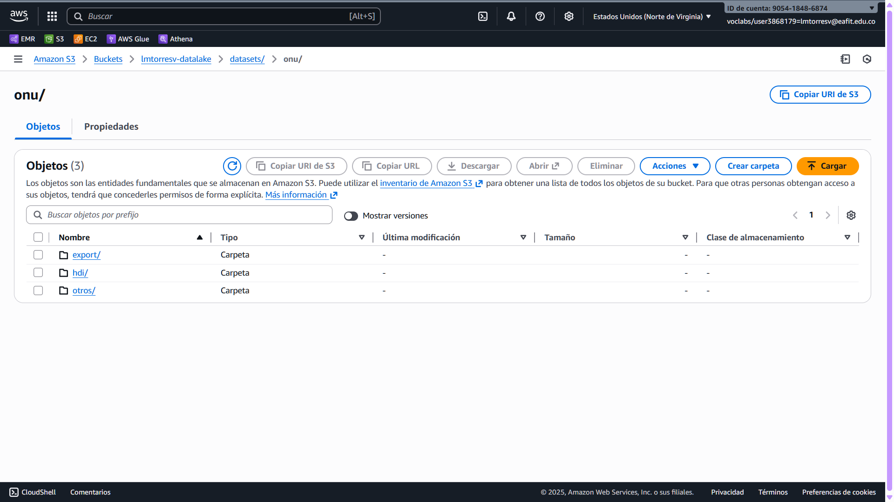

## Catalogación (AWS Glue)

### Creación de la base de datos

Creé la base de datos `onudb` en Glue:

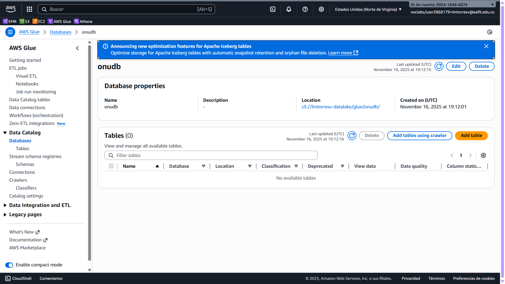

### Creación del crawler

Seleccioné la ubicación de los datos de la ONU en S3:

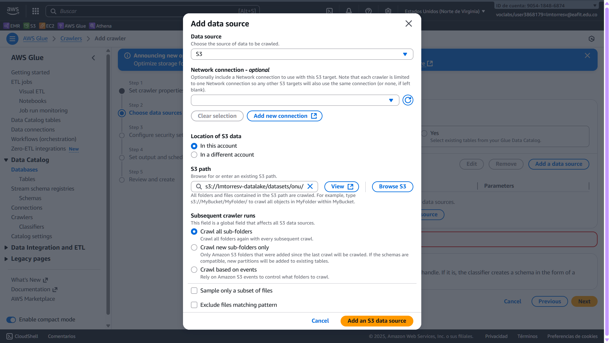

Verificación antes de crear el crawler con todos los detalles:

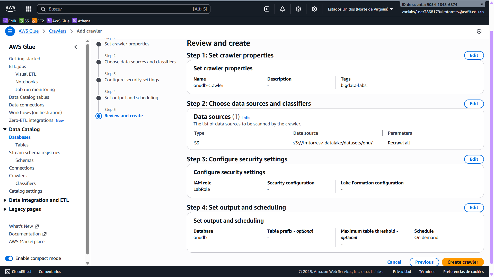

### Corriendo el crawler

Corrí el crawler manualmente:

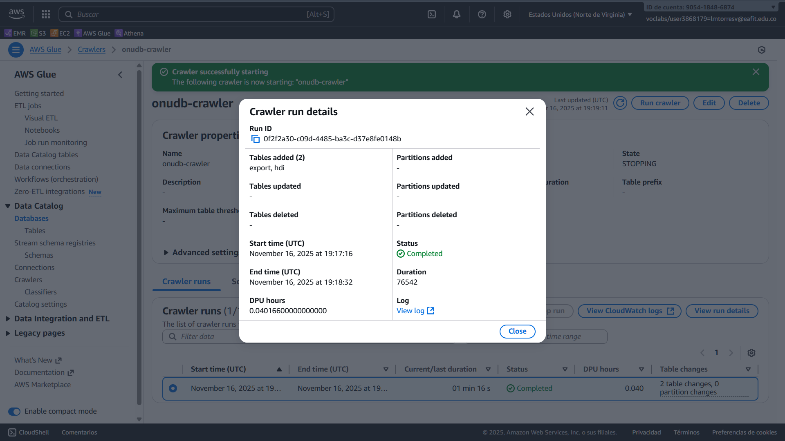

Log en AWS CloudWatch:

```
[0f2f2a30-c09d-4485-ba3c-d37e8fe0148b] BENCHMARK : Running Start Crawl for Crawler onudb-crawler
[0f2f2a30-c09d-4485-ba3c-d37e8fe0148b] BENCHMARK : Classification complete, writing results to database onudb
[0f2f2a30-c09d-4485-ba3c-d37e8fe0148b] INFO : Crawler configured with Configuration
{
    "Version": 1,
    "CreatePartitionIndex": true
}
 and SchemaChangePolicy
{
    "UpdateBehavior": "UPDATE_IN_DATABASE",
    "DeleteBehavior": "DEPRECATE_IN_DATABASE"
}
. Note that values in the Configuration override values in the SchemaChangePolicy for S3 Targets.
[0f2f2a30-c09d-4485-ba3c-d37e8fe0148b] INFO : Created table export in database onudb
[0f2f2a30-c09d-4485-ba3c-d37e8fe0148b] INFO : Created table hdi in database onudb
[0f2f2a30-c09d-4485-ba3c-d37e8fe0148b] BENCHMARK : Finished writing to Catalog
[0f2f2a30-c09d-4485-ba3c-d37e8fe0148b] INFO : Run Summary For TABLE:
[0f2f2a30-c09d-4485-ba3c-d37e8fe0148b] INFO : ADD: 2
[0f2f2a30-c09d-4485-ba3c-d37e8fe0148b] BENCHMARK : Crawler has finished running and is in state READY
```

### Revisando el resultado del crawler

Comprobé que se crearon las dos (2) tablas:

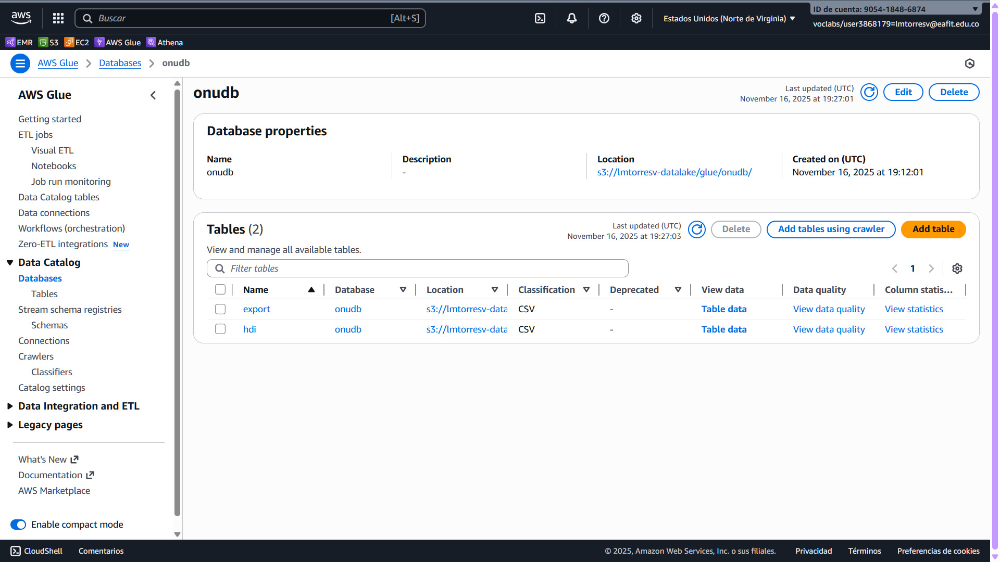

### Tabla `hdi`

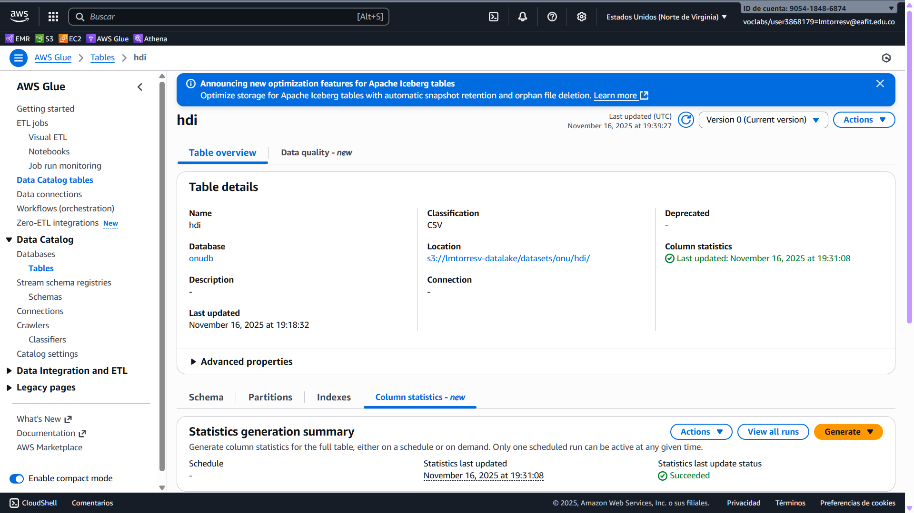

Incluso generé estadísticas de las columnas como forma rápida de comprobar
que están los datos ahí:

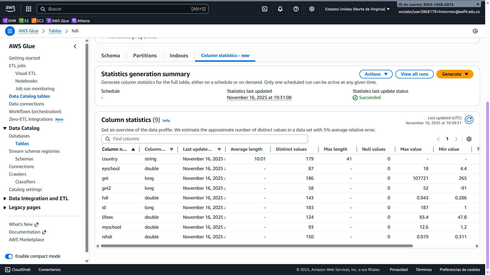

Creo que es una función nueva en Glue. No sé cómo está implementada.
Solo sé que le di clic a un botón y lo generó. Lo que quiero decir es que, en
esta parte, no se usa Athena directamente.

### Tabla `export`

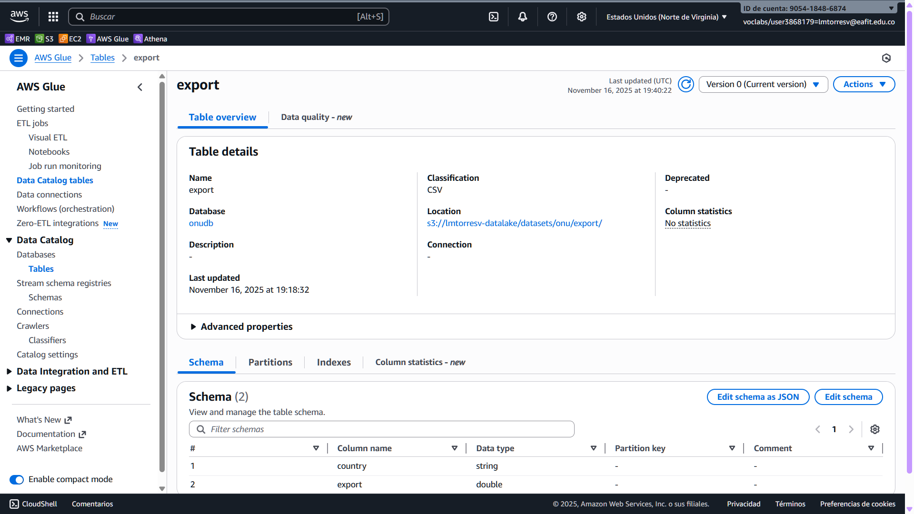

(A este no le generé estadísticas de columnas.)

## Consulta (AWS Athena)

### Configuración de Athena

Anteriorme creé un directorio `athena` en el bucket S3 para guardar allí
los resultados de las consultas de Athena. Acá configuré Athena para que use
este directorio:

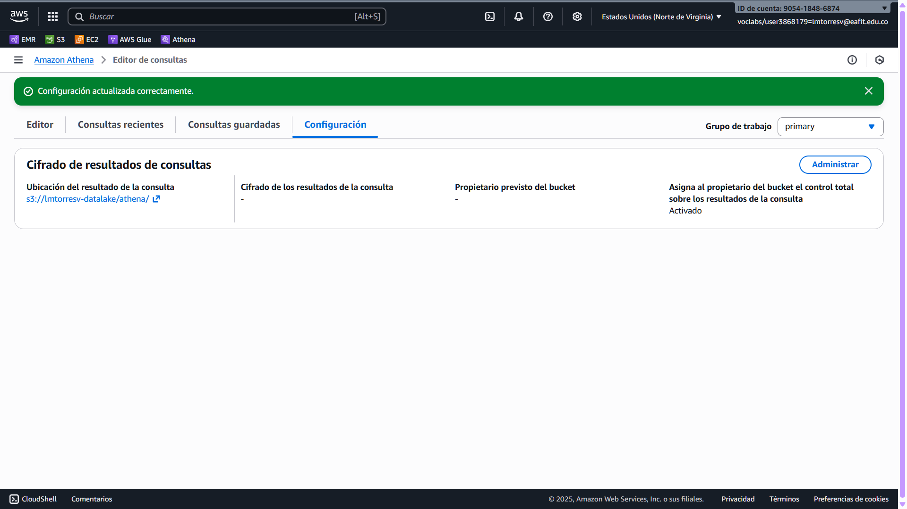

### Consultas básicas de vista previa de la tabla

#### `export`

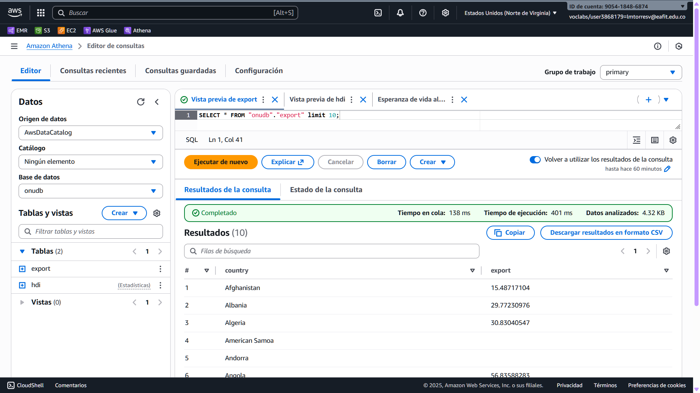

#### `hdi`

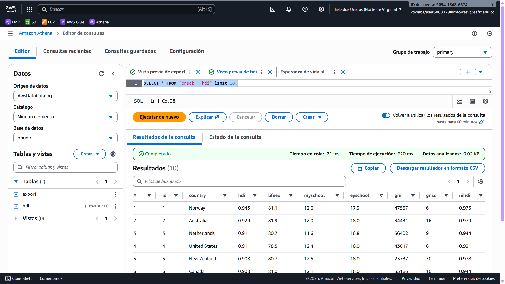

#### `lifeex < 60`

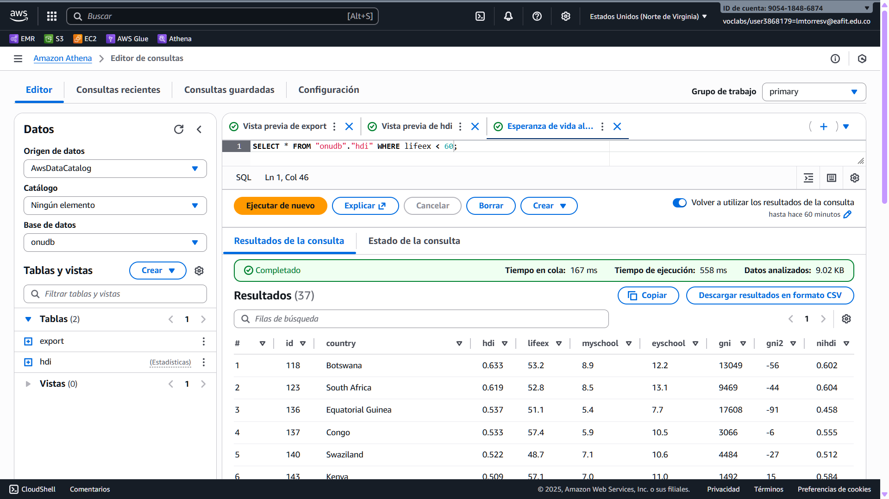
