# Laboratorio 3: Procesamiento SQL con Apache Hive

## Creación de la base de datos


<details>
<summary>
Output de ejecución completo
</summary>
<pre>
INFO  : Compiling command(queryId=hive_20251116212222_0a227532-d9e9-45b0-8d25-caa24192bf5b):
CREATE DATABASE lmtorresv
INFO  : Concurrency mode is disabled, not creating a lock manager
INFO  : Semantic Analysis Completed (retrial = false)
INFO  : Returning Hive schema: Schema(fieldSchemas:null, properties:null)
INFO  : Completed compiling command(queryId=hive_20251116212222_0a227532-d9e9-45b0-8d25-caa24192bf5b); Time taken: 0.003 seconds
INFO  : Concurrency mode is disabled, not creating a lock manager
INFO  : Executing command(queryId=hive_20251116212222_0a227532-d9e9-45b0-8d25-caa24192bf5b):
CREATE DATABASE lmtorresv
INFO  : Starting task [Stage-0:DDL] in serial mode
INFO  : Completed executing command(queryId=hive_20251116212222_0a227532-d9e9-45b0-8d25-caa24192bf5b); Time taken: 0.129 seconds
INFO  : OK
INFO  : Concurrency mode is disabled, not creating a lock manager
</pre>
</details>

## Creación de la tabla manejada `hdi`

### Query

```sql
USE lmtorresv;

CREATE TABLE HDI (
    id INT,
    country STRING,
    hdi FLOAT,
    lifeex INT,
    mysch INT,
    eysch INT,
    gni INT
)

ROW FORMAT DELIMITED FIELDS
TERMINATED BY ','
STORED AS TEXTFILE
TBLPROPERTIES ("skip.header.line.count"="1");
```

### Confirmación visual

Al terminar la consulta de Hive en Hue:

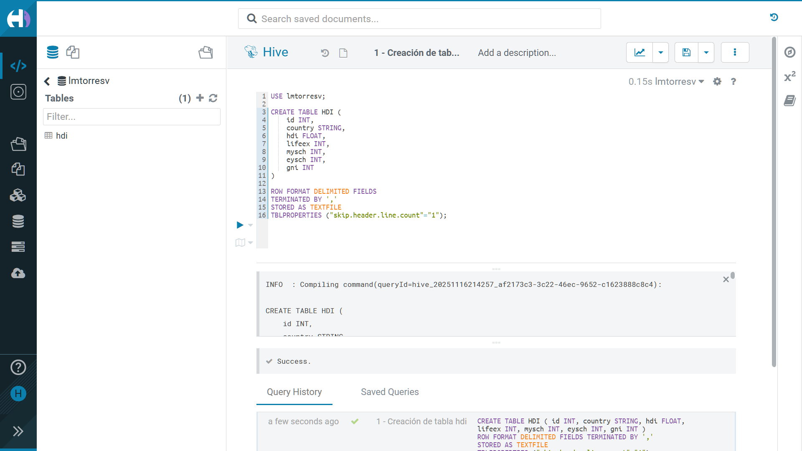

Desde el _Table Browser_ de Hue:

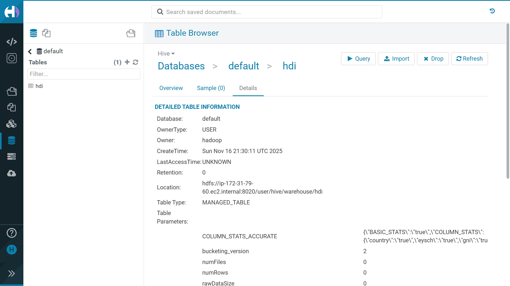

<details>
<summary>
Output de ejecución completo
</summary>
<pre>
INFO  : Compiling command(queryId=hive_20251116214257_af2173c3-3c22-46ec-9652-c1623888c8c4):

CREATE TABLE HDI (
    id INT,
    country STRING,
    hdi FLOAT,
    lifeex INT,
    mysch INT,
    eysch INT,
    gni INT
)

ROW FORMAT DELIMITED FIELDS
TERMINATED BY ','
STORED AS TEXTFILE
TBLPROPERTIES ("skip.header.line.count"="1")
INFO  : Concurrency mode is disabled, not creating a lock manager
INFO  : Semantic Analysis Completed (retrial = false)
INFO  : Returning Hive schema: Schema(fieldSchemas:null, properties:null)
INFO  : Completed compiling command(queryId=hive_20251116214257_af2173c3-3c22-46ec-9652-c1623888c8c4); Time taken: 0.006 seconds
INFO  : Concurrency mode is disabled, not creating a lock manager
INFO  : Executing command(queryId=hive_20251116214257_af2173c3-3c22-46ec-9652-c1623888c8c4):

CREATE TABLE HDI (
    id INT,
    country STRING,
    hdi FLOAT,
    lifeex INT,
    mysch INT,
    eysch INT,
    gni INT
)

ROW FORMAT DELIMITED FIELDS
TERMINATED BY ','
STORED AS TEXTFILE
TBLPROPERTIES ("skip.header.line.count"="1")
INFO  : Starting task [Stage-0:DDL] in serial mode
INFO  : Completed executing command(queryId=hive_20251116214257_af2173c3-3c22-46ec-9652-c1623888c8c4); Time taken: 0.029 seconds
INFO  : OK
INFO  : Concurrency mode is disabled, not creating a lock manager
</pre>
</details>

## Cargar datos a la tabla `hdi`

Decidí cargarlos usando la CLI. Solo tuve que cambiar los parámetros al comando
`hdfs`, con respecto a como estaban en la guía, para que funcionara:

```shell
[hadoop@ip-172-31-79-60 ~]$ hdfs dfs -cp \
  /user/hadoop/datasets/onu/hdi-data.csv \
  /user/hive/warehouse/lmtorresv.db/hdi
```

Y ahora aparece listado el archivo, tanto en la CLI…

```shell
[hadoop@ip-172-31-79-60 ~]$ hdfs dfs -ls /user/hive/warehouse/lmtorresv.db/hdi
Found 1 items
-rw-r--r--   1 hadoop hdfsadmingroup       9235 2025-11-16 21:52 /user/hive/warehouse/lmtorresv.db/hdi/hdi-data.csv
```

Como en Hue:

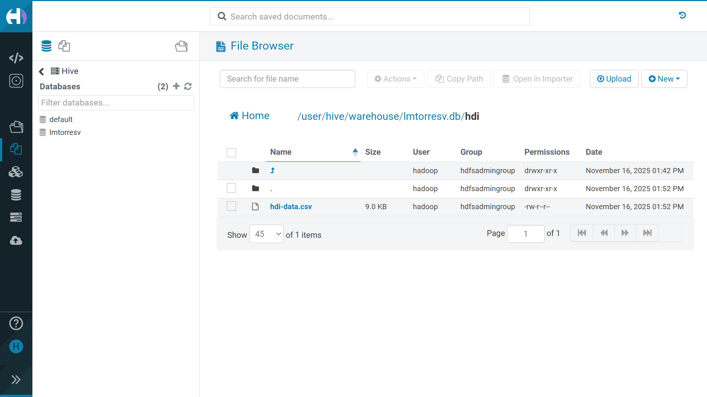

Verifiqué que se reflejaran los cambios en el _Table Browser_:

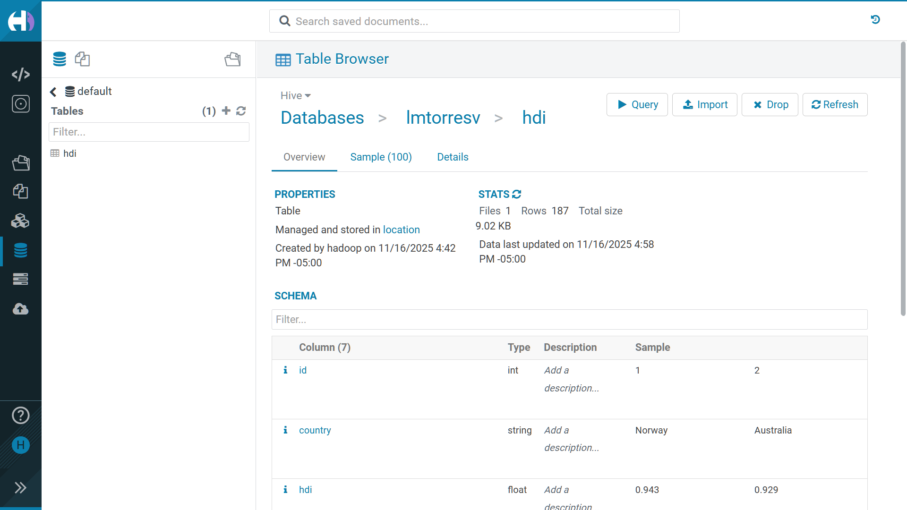

Y comprobé que haya interpretado bien el header con una muestra:

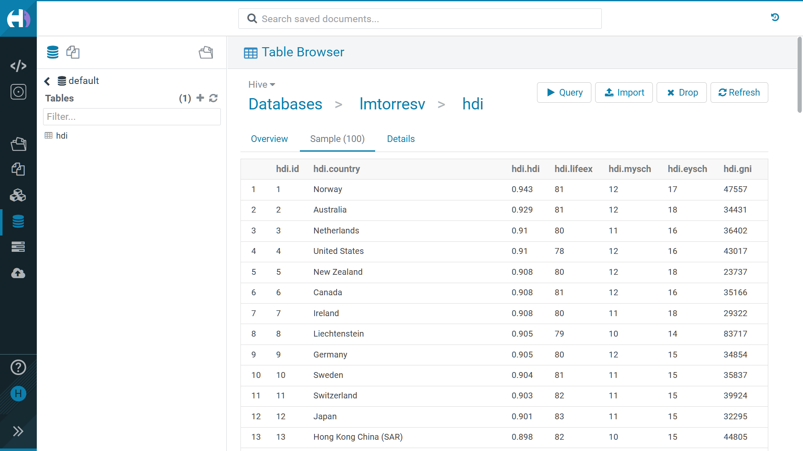

## Creando tablas externas

### Usando HDFS

Corrí estos comandos con Hive:

```sql
use lmtorresv;


CREATE
EXTERNAL
TABLE hdi_hdfs (
    id INT,
    country STRING,
    hdi FLOAT,
    lifeex INT,
    mysch INT,
    eysch INT,
    gni INT
)

ROW FORMAT DELIMITED FIELDS
TERMINATED BY ','
STORED AS TEXTFILE
LOCATION '/user/hadoop/datasets/onu/hdi/'
TBLPROPERTIES ("skip.header.line.count"="1");
```

#### Verificación

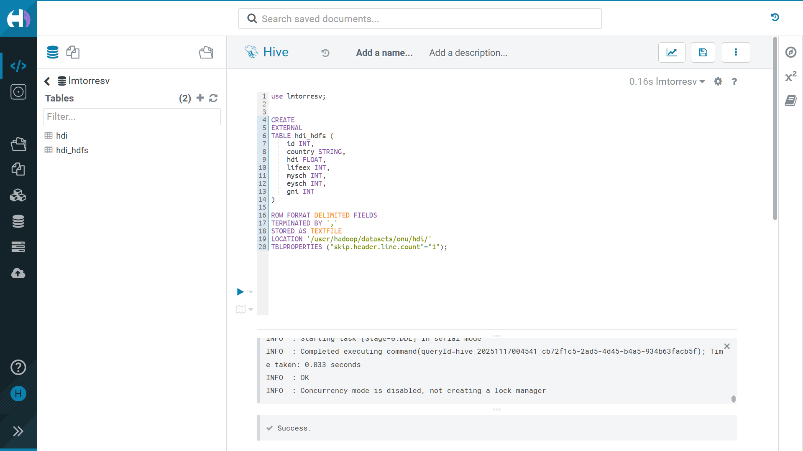

En _Table Browser_ de Hue:

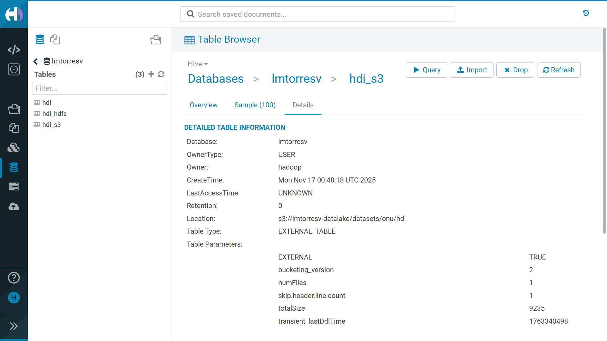

### Usando S3

Corrí estos comandos con Hive:

```sql
use lmtorresv;


CREATE
EXTERNAL
TABLE hdi_s3 (
    id INT,
    country STRING,
    hdi FLOAT,
    lifeex INT,
    mysch INT,
    eysch INT,
    gni INT
)

ROW FORMAT DELIMITED FIELDS
TERMINATED BY ','
STORED AS TEXTFILE
LOCATION 's3://lmtorresv-datalake/datasets/onu/hdi/'
TBLPROPERTIES ("skip.header.line.count"="1");
```

#### Verificación

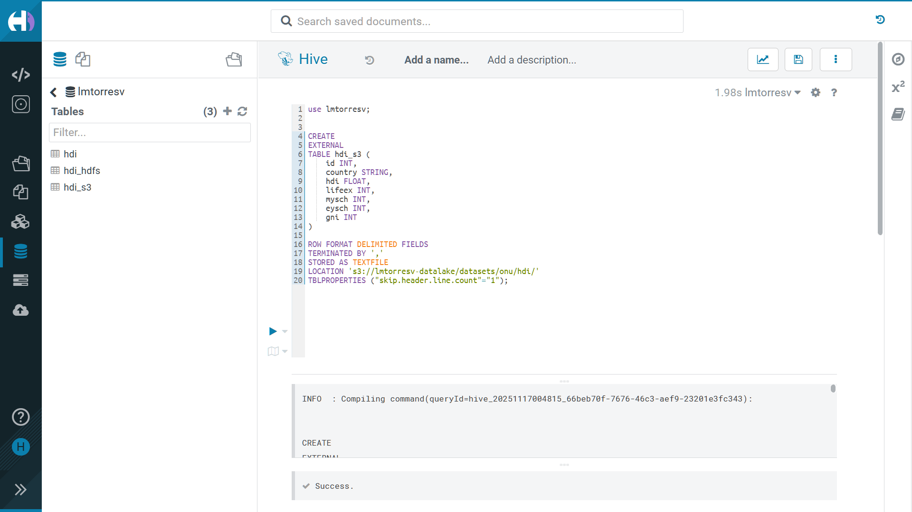

En _Table Browser_ de Hue:

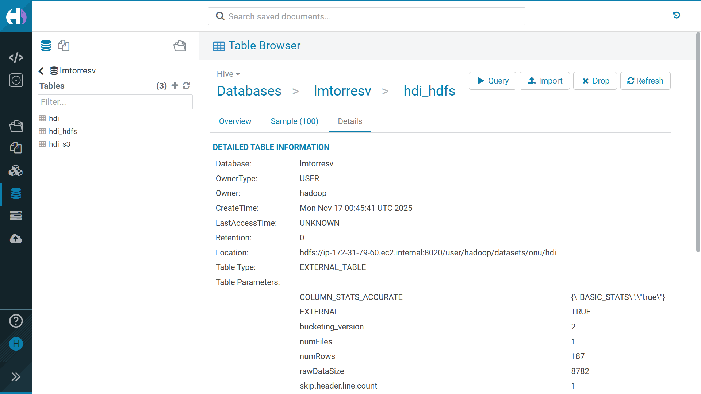

## Realizar consultas y cálculos sobre la tabla `hdi`

### `gni > 2000`

#### Consulta

```sql
SELECT
    country,
    gni
FROM
    hdi
WHERE
    gni > 2000;
```

#### Confirmación visual

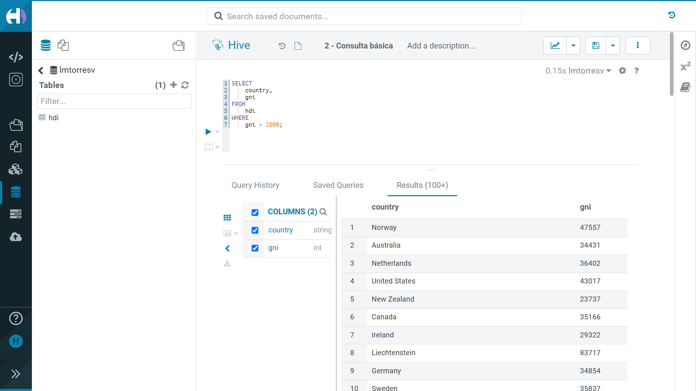

<details>
<summary>
Output de ejecución completo
</summary>
<pre>
INFO  : Compiling command(queryId=hive_20251116224306_d266db8e-30de-45ba-8c51-14e9bba53475): SELECT
    country,
    gni
FROM
    hdi
WHERE
    gni > 2000
INFO  : Concurrency mode is disabled, not creating a lock manager
INFO  : Semantic Analysis Completed (retrial = false)
INFO  : Returning Hive schema: Schema(fieldSchemas:[FieldSchema(name:country, type:string, comment:null), FieldSchema(name:gni, type:int, comment:null)], properties:null)
INFO  : Completed compiling command(queryId=hive_20251116224306_d266db8e-30de-45ba-8c51-14e9bba53475); Time taken: 0.072 seconds
INFO  : Concurrency mode is disabled, not creating a lock manager
INFO  : Executing command(queryId=hive_20251116224306_d266db8e-30de-45ba-8c51-14e9bba53475): SELECT
    country,
    gni
FROM
    hdi
WHERE
    gni > 2000
INFO  : Completed executing command(queryId=hive_20251116224306_d266db8e-30de-45ba-8c51-14e9bba53475); Time taken: 0.0 seconds
INFO  : OK
INFO  : Concurrency mode is disabled, not creating a lock manager
</pre>
</details>

### Países con mayor número de años promedio de escolaridad (`mysch`)

```sql
-- mysch → mean years of schooling
FROM hdi
SELECT country, mysch
ORDER BY mysch DESC
LIMIT 10;
```

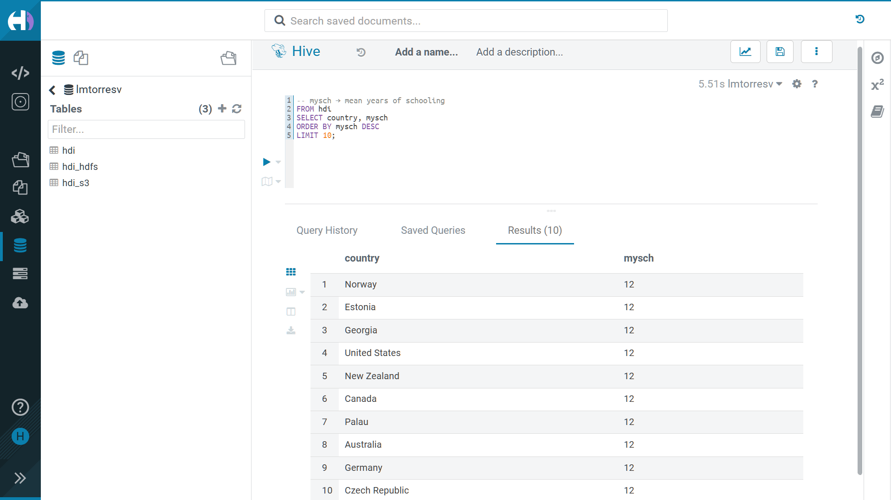

<details>
<summary>
Output de ejecución completo
</summary>
<pre>
INFO  : Compiling command(queryId=hive_20251117010835_01a2d93b-258b-484f-9d86-c220b7aa53e6): -- mysch → mean years of schooling
FROM hdi
SELECT country, mysch
ORDER BY mysch DESC
LIMIT 10
INFO  : Concurrency mode is disabled, not creating a lock manager
INFO  : Semantic Analysis Completed (retrial = false)
INFO  : Returning Hive schema: Schema(fieldSchemas:[FieldSchema(name:country, type:string, comment:null), FieldSchema(name:mysch, type:int, comment:null)], properties:null)
INFO  : Completed compiling command(queryId=hive_20251117010835_01a2d93b-258b-484f-9d86-c220b7aa53e6); Time taken: 0.065 seconds
INFO  : Concurrency mode is disabled, not creating a lock manager
INFO  : Executing command(queryId=hive_20251117010835_01a2d93b-258b-484f-9d86-c220b7aa53e6): -- mysch → mean years of schooling
FROM hdi
SELECT country, mysch
ORDER BY mysch DESC
LIMIT 10
INFO  : Query ID = hive_20251117010835_01a2d93b-258b-484f-9d86-c220b7aa53e6
INFO  : Total jobs = 1
INFO  : Launching Job 1 out of 1
INFO  : Starting task [Stage-1:MAPRED] in serial mode
INFO  : Subscribed to counters: [] for queryId: hive_20251117010835_01a2d93b-258b-484f-9d86-c220b7aa53e6
INFO  : Tez session hasn't been created yet. Opening session
INFO  : Dag name: -- mysch → mean years of schooling
FROM...10 (Stage-1)
INFO  : Status: Running (Executing on YARN cluster with App id application_1763307644791_0010)

INFO  : Map 1: -/-	Reducer 2: 0/1
INFO  : Map 1: 0/1	Reducer 2: 0/1
INFO  : Map 1: 0(+1)/1	Reducer 2: 0/1
INFO  : Map 1: 1/1	Reducer 2: 0(+1)/1
INFO  : Map 1: 1/1	Reducer 2: 1/1
INFO  : Completed executing command(queryId=hive_20251117010835_01a2d93b-258b-484f-9d86-c220b7aa53e6); Time taken: 14.658 seconds
INFO  : OK
INFO  : Concurrency mode is disabled, not creating a lock manager
</pre>
</details>

### Número de años esperados de escolaridad (`eysch`) menos el número de años promedio de escolaridad (`mysch`)

```sql
SELECT
    country,
    mysch,
    eysch,
    (eysch - mysch) AS schooling_gap
FROM
    hdi
ORDER BY
    schooling_gap DESC;
```

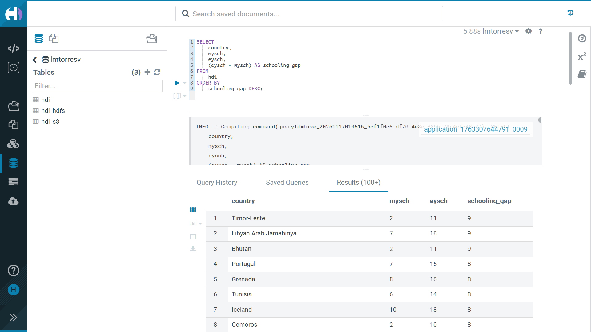

<details>
<summary>
Output de ejecución completo
</summary>
<pre>
INFO  : Compiling command(queryId=hive_20251117010516_5cf1f0c6-df70-4e8e-8896-79c4e1c48a77): SELECT
    country,
    mysch,
    eysch,
    (eysch - mysch) AS schooling_gap
FROM
    hdi
ORDER BY
    schooling_gap DESC
INFO  : Concurrency mode is disabled, not creating a lock manager
INFO  : Semantic Analysis Completed (retrial = false)
INFO  : Returning Hive schema: Schema(fieldSchemas:[FieldSchema(name:country, type:string, comment:null), FieldSchema(name:mysch, type:int, comment:null), FieldSchema(name:eysch, type:int, comment:null), FieldSchema(name:schooling_gap, type:int, comment:null)], properties:null)
INFO  : Completed compiling command(queryId=hive_20251117010516_5cf1f0c6-df70-4e8e-8896-79c4e1c48a77); Time taken: 0.078 seconds
INFO  : Concurrency mode is disabled, not creating a lock manager
INFO  : Executing command(queryId=hive_20251117010516_5cf1f0c6-df70-4e8e-8896-79c4e1c48a77): SELECT
    country,
    mysch,
    eysch,
    (eysch - mysch) AS schooling_gap
FROM
    hdi
ORDER BY
    schooling_gap DESC
INFO  : Query ID = hive_20251117010516_5cf1f0c6-df70-4e8e-8896-79c4e1c48a77
INFO  : Total jobs = 1
INFO  : Launching Job 1 out of 1
INFO  : Starting task [Stage-1:MAPRED] in serial mode
INFO  : Subscribed to counters: [] for queryId: hive_20251117010516_5cf1f0c6-df70-4e8e-8896-79c4e1c48a77
INFO  : Session is already open
INFO  : Dag name: SELECT
    country,
    mysch,
   ...DESC (Stage-1)
INFO  : Status: Running (Executing on YARN cluster with App id application_1763307644791_0009)

INFO  : Map 1: -/-	Reducer 2: 0/1
</pre>
</details>
