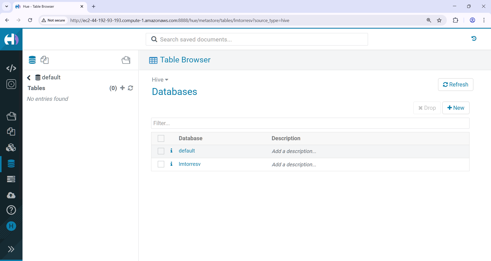

# Laboratorio 3: Procesamiento SQL con Apache Hive

## Creación de la base de datos



```
INFO  : Compiling command(queryId=hive_20251116212222_0a227532-d9e9-45b0-8d25-caa24192bf5b):
CREATE DATABASE lmtorresv
INFO  : Concurrency mode is disabled, not creating a lock manager
INFO  : Semantic Analysis Completed (retrial = false)
INFO  : Returning Hive schema: Schema(fieldSchemas:null, properties:null)
INFO  : Completed compiling command(queryId=hive_20251116212222_0a227532-d9e9-45b0-8d25-caa24192bf5b); Time taken: 0.003 seconds
INFO  : Concurrency mode is disabled, not creating a lock manager
INFO  : Executing command(queryId=hive_20251116212222_0a227532-d9e9-45b0-8d25-caa24192bf5b):
CREATE DATABASE lmtorresv
INFO  : Starting task [Stage-0:DDL] in serial mode
INFO  : Completed executing command(queryId=hive_20251116212222_0a227532-d9e9-45b0-8d25-caa24192bf5b); Time taken: 0.129 seconds
INFO  : OK
INFO  : Concurrency mode is disabled, not creating a lock manager
```
