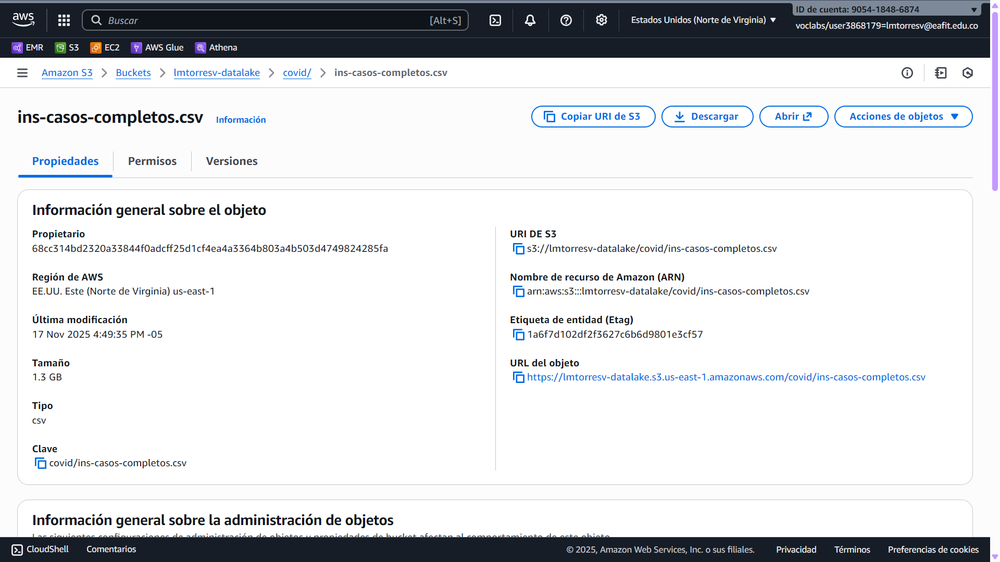
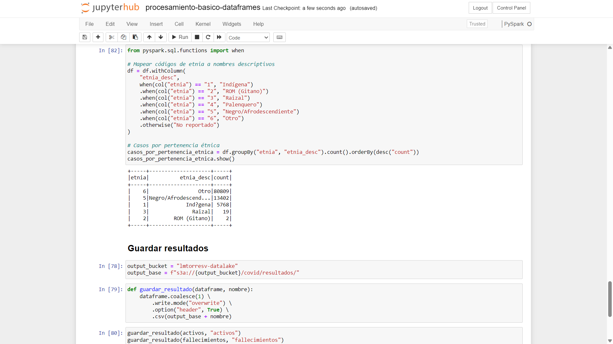
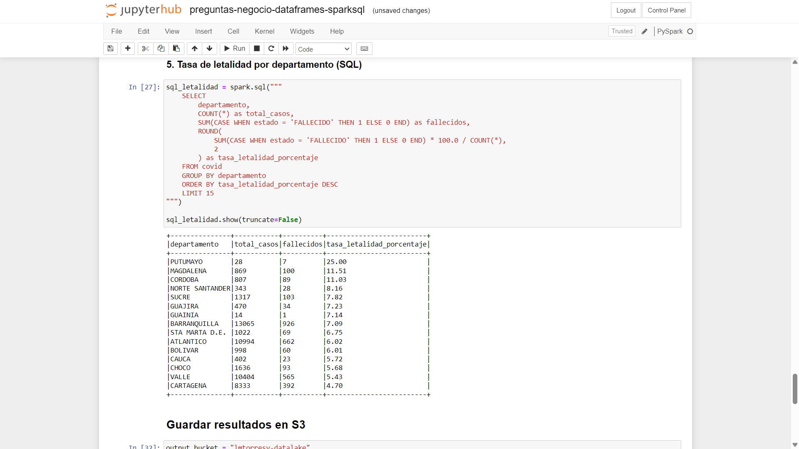

# Laboratorio 4: Usando Apache Spark

## Ejecución de cuadernos

### Resumen tabular con enlaces a evidencias

| Cuaderno | Ambiente | Fuente de datos | Evidencia |
|:--|:--|---|:--|
| Data_processing_using_PySpark | EMR | AWS S3 | [emr-s3.ipynb][1] |
| Data_processing_using_PySpark | Colab | Google Drive | [colab-gdrive.ipynb][2] |
| Data_processing_using_PySpark | Colab | AWS S3 | [colab-s3.ipynb][3] |
| spark_colab_ejercicios | EMR | AWS S3 | [emr-s3.ipynb][4] |
| spark_colab_ejercicios | Colab | Google Drive| [colab-gdrive.ipynb][5] |
| wordcount-spark | EMR | AWS S3 | [emr-s3.ipynb][6] |
| wordcount-spark | Colab | Google Drive | [colab-gdrive.ipynb][7] |

[1]: <notebooks/Data_processing_using_PySpark/emr-s3.ipynb>
[2]: <notebooks/Data_processing_using_PySpark/colab-gdrive.ipynb>
[3]: <notebooks/Data_processing_using_PySpark/colab-s3.ipynb>
[4]: <notebooks/spark_colab_ejercicios/emr-s3.ipynb>
[5]: <notebooks/spark_colab_ejercicios/colab-gdrive.ipynb>
[6]: <notebooks/wordcount-spark/emr-s3.ipynb>
[7]: <notebooks/wordcount-spark/colab-gdrive.ipynb>

> [!TIP]
>
> Para ver los archivos de salida generados durante la ejecución de los cuadernos
> en el ambiente de Google Colab, puede acceder
> [al directorio `spark-lab/out` en Google Drive](https://drive.google.com/drive/folders/1bGS_NmMgFfD_NDDIoAr3Q5r20dPeqsoZ?usp=sharing).

### Configuración de Google Colab

#### Cargando los datasets


#### Cargando los cuadernos


#### Dando acceso


#### Verificación


### Problemas que se presentaron

#### `spark_colab_ejercicios`

No fue posible correr el PageRank con el paquete `graphframes`.

Le pregunté a ChatGPT, porque no tengo ni idea de cómo funciona el sistema de
paquetes en Colab o en JupyterHub, y me dijo que:

> ChatGPT said:GraphFrames does not load in Colab’s Spark 4.x runtime because
> GraphFrames’ latest release (0.8.3) is built for Spark 3.5, while Google Colab
> now bundles Spark 4.0.1.
>
> The JVM classloader rejects the JAR, leaving
> `org.graphframes.GraphFramePythonAPI` unavailable, which produces the exact
> error you see.
>
> There is no compatible GraphFrames build for Spark 4.x.
>
> To use GraphFrames in Colab, you must run Spark 3.5.x, not Spark 4.x.

No sé qué tanta raźón tenga, pero intenté varias cosas y ninguna permitió
correrlo con éxito.

### Ejecución de `wc-pyspark.py` en el nodo principal de EMR

#### Verificación de la tarea

```
[hadoop@ip-172-31-70-192 ~]$ cat wc-pyspark.py
from pyspark.sql import SparkSession

spark = SparkSession.builder.appName("WordCount").getOrCreate()
sc = spark.sparkContext

files = sc.textFile("s3://lmtorresv-datalake/datasets/gutenberg-small/*.txt")
wc = (
    files.flatMap(lambda line: line.split(" "))
    .map(lambda word: (word, 1))
    .reduceByKey(lambda a, b: a + b)
)
wc.coalesce(1).saveAsTextFile("hdfs:///tmp/wcount1")
```

#### Log del proceso de la tarea

```
[hadoop@ip-172-31-70-192 ~]$ spark-submit --master yarn --deploy-mode cluster wc-pyspark.py
25/11/17 20:47:56 WARN NativeCodeLoader: Unable to load native-hadoop library for your platform... using builtin-java classes where applicable
25/11/17 20:47:56 INFO DefaultNoHARMFailoverProxyProvider: Connecting to ResourceManager at ip-172-31-70-192.ec2.internal/172.31.70.192:8032
25/11/17 20:47:57 INFO Configuration: resource-types.xml not found
25/11/17 20:47:57 INFO ResourceUtils: Unable to find 'resource-types.xml'.
25/11/17 20:47:57 INFO Client: Verifying our application has not requested more than the maximum memory capability of the cluster (12288 MB per container)
25/11/17 20:47:57 INFO Client: Will allocate AM container, with 2432 MB memory including 384 MB overhead
25/11/17 20:47:57 INFO Client: Setting up container launch context for our AM
25/11/17 20:47:57 INFO Client: Setting up the launch environment for our AM container
25/11/17 20:47:57 INFO Client: Preparing resources for our AM container
25/11/17 20:47:57 WARN Client: Neither spark.yarn.jars nor spark.yarn.archive is set, falling back to uploading libraries under SPARK_HOME.
25/11/17 20:47:58 INFO Client: Uploading resource file:/mnt/tmp/spark-ac05267c-cb38-4cc5-894a-3b89ae187688/__spark_libs__8977531645018525105.zip -> hdfs://ip-172-31-70-192.ec2.internal:8020/user/hadoop/.sparkStaging/application_1763396678263_0007/__spark_libs__8977531645018525105.zip
25/11/17 20:48:00 INFO Client: Uploading resource file:/etc/spark/conf.dist/hive-site.xml -> hdfs://ip-172-31-70-192.ec2.internal:8020/user/hadoop/.sparkStaging/application_1763396678263_0007/hive-site.xml
25/11/17 20:48:00 INFO Client: Uploading resource file:/etc/hudi/conf.dist/hudi-defaults.conf -> hdfs://ip-172-31-70-192.ec2.internal:8020/user/hadoop/.sparkStaging/application_1763396678263_0007/hudi-defaults.conf
25/11/17 20:48:00 INFO Client: Uploading resource file:/home/hadoop/wc-pyspark.py -> hdfs://ip-172-31-70-192.ec2.internal:8020/user/hadoop/.sparkStaging/application_1763396678263_0007/wc-pyspark.py
25/11/17 20:48:00 INFO Client: Uploading resource file:/usr/lib/spark/python/lib/pyspark.zip -> hdfs://ip-172-31-70-192.ec2.internal:8020/user/hadoop/.sparkStaging/application_1763396678263_0007/pyspark.zip
25/11/17 20:48:00 INFO Client: Uploading resource file:/usr/lib/spark/python/lib/py4j-0.10.9.7-src.zip -> hdfs://ip-172-31-70-192.ec2.internal:8020/user/hadoop/.sparkStaging/application_1763396678263_0007/py4j-0.10.9.7-src.zip
25/11/17 20:48:00 INFO Client: Uploading resource file:/mnt/tmp/spark-ac05267c-cb38-4cc5-894a-3b89ae187688/__spark_conf__15595027511123097589.zip -> hdfs://ip-172-31-70-192.ec2.internal:8020/user/hadoop/.sparkStaging/application_1763396678263_0007/__spark_conf__.zip
25/11/17 20:48:00 INFO SecurityManager: Changing view acls to: hadoop
25/11/17 20:48:00 INFO SecurityManager: Changing modify acls to: hadoop
25/11/17 20:48:00 INFO SecurityManager: Changing view acls groups to:
25/11/17 20:48:00 INFO SecurityManager: Changing modify acls groups to:
25/11/17 20:48:00 INFO SecurityManager: SecurityManager: authentication disabled; ui acls disabled; users with view permissions: hadoop; groups with view permissions: EMPTY; users with modify permissions: hadoop; groups with modify permissions: EMPTY
25/11/17 20:48:00 INFO Client: Submitting application application_1763396678263_0007 to ResourceManager
25/11/17 20:48:00 INFO YarnClientImpl: Submitted application application_1763396678263_0007
25/11/17 20:48:01 INFO Client: Application report for application_1763396678263_0007 (state: ACCEPTED)
25/11/17 20:48:01 INFO Client:
         client token: N/A
         diagnostics: AM container is launched, waiting for AM container to Register with RM
         ApplicationMaster host: N/A
         ApplicationMaster RPC port: -1
         queue: root.default
         start time: 1763412480591
         final status: UNDEFINED
         tracking URL: http://ip-172-31-70-192.ec2.internal:20888/proxy/application_1763396678263_0007/
         user: hadoop
25/11/17 20:48:09 INFO Client: Application report for application_1763396678263_0007 (state: RUNNING)
25/11/17 20:48:09 INFO Client:
         client token: N/A
         diagnostics: N/A
         ApplicationMaster host: ip-172-31-76-66.ec2.internal
         ApplicationMaster RPC port: 38557
         queue: root.default
         start time: 1763412480591
         final status: UNDEFINED
         tracking URL: http://ip-172-31-70-192.ec2.internal:20888/proxy/application_1763396678263_0007/
         user: hadoop
25/11/17 20:48:21 INFO Client: Application report for application_1763396678263_0007 (state: FINISHED)
25/11/17 20:48:21 INFO Client:
         client token: N/A
         diagnostics: N/A
         ApplicationMaster host: ip-172-31-76-66.ec2.internal
         ApplicationMaster RPC port: 38557
         queue: root.default
         start time: 1763412480591
         final status: SUCCEEDED
         tracking URL: http://ip-172-31-70-192.ec2.internal:20888/proxy/application_1763396678263_0007/
         user: hadoop
25/11/17 20:48:21 INFO ShutdownHookManager: Shutdown hook called
25/11/17 20:48:21 INFO ShutdownHookManager: Deleting directory /mnt/tmp/spark-0e6b7d3d-49e1-47ff-84ae-a7be82f18dd2
25/11/17 20:48:21 INFO ShutdownHookManager: Deleting directory /mnt/tmp/spark-ac05267c-cb38-4cc5-894a-3b89ae187688
```

```
('', 27298)
('thoroughly', 15)
('themselves', 192)
('them.', 371)
('letter', 312)
('A.', 1456)
('ORIGINALS', 1)
('THEY', 1)
('sum', 59)
('singular', 18)
```

> ![NOTE]
>
> El resultado completo, con las 38 863 filas, está en
> [`output/part-00000`](output/part-00000).

## Procesamiento de datos de COVID-19

### Carga de datos

Me descargué el archivo en CSV de 1.3 GB con las 6.39 millones de líneas de

> Instituto Nacional de Salud. 2024-08-14.
> "Casos positivos de COVID-19 en Colombia".
> URL:
> <https://www.datos.gov.co/Salud-y-Protecci-n-Social/Casos-positivos-de-COVID-19-en-Colombia-/gt2j-8ykr/>

Subí el archivo a mi bucket S3:

```shell
$ aws s3 cp /mnt/c/tmp/Casos_positivos_de_COVID-19_en_Colombia._20251117.csv s3://lmtorresv-datalake/covid/ins-casos-completos.csv
upload: ../../mnt/c/tmp/Casos_positivos_de_COVID-19_en_Colombia._20251117.csv to s3://lmtorresv-datalake/covid/ins-casos-completos.csv
```



### Análisis exploratorio de datos

1. Cargué los datos desde S3.
2. Normalicé datos en algunas columnas.
3. Apliqué filtros para analizar los datos.
4. Realicé agrupaciones y consultas categóricas.
5. Guardé los resultados como archivos csv en el bucket.

### Evidencias

#### Visual

Una vista previa del cuaderno en JupyterHub:



#### Cuaderno

> [!NOTE]
>
> El cuaderno de esta sección se encuentra en
> [`notebooks/procesamiento-basico-dataframes.ipynb`](notebooks/procesamiento-basico-dataframes.ipynb).

#### Listado de resultados en S3

```
$ aws s3 ls --recursive --human-readable --summarize s3://lmtorresv-datalake/covid/resultados/
2025-11-17 19:33:24    0 Bytes covid/resultados/csv/activos/_SUCCESS
2025-11-17 19:33:23   15.4 MiB covid/resultados/csv/activos/part-00000-e9f5afe9-1d35-48a6-8618-81f8dab914ec-c000.csv
2025-11-17 19:33:39    0 Bytes covid/resultados/csv/casos_por_pertenencia_etnica/_SUCCESS
2025-11-17 19:33:39  112 Bytes covid/resultados/csv/casos_por_pertenencia_etnica/part-00000-b2bf38a2-2003-4fd0-90e6-c3b1f53dae4b-c000.csv
2025-11-17 19:33:32    0 Bytes covid/resultados/csv/casos_por_sexo/_SUCCESS
2025-11-17 19:33:32   27 Bytes covid/resultados/csv/casos_por_sexo/part-00000-8283e715-16e7-4617-8d89-b0a05d38b6cd-c000.csv
2025-11-17 19:33:34    0 Bytes covid/resultados/csv/casos_por_tipo_de_contagio/_SUCCESS
2025-11-17 19:33:34   85 Bytes covid/resultados/csv/casos_por_tipo_de_contagio/part-00000-c6dde07a-769c-4b18-83ad-992a0759afd6-c000.csv
2025-11-17 19:33:38    0 Bytes covid/resultados/csv/casos_por_tipo_de_recuperacion/_SUCCESS
2025-11-17 19:33:38   53 Bytes covid/resultados/csv/casos_por_tipo_de_recuperacion/part-00000-cfe3f9f9-3f26-42ec-b722-0f35a2f21eaf-c000.csv
2025-11-17 19:33:35    0 Bytes covid/resultados/csv/casos_por_ubicacion/_SUCCESS
2025-11-17 19:33:35   50 Bytes covid/resultados/csv/casos_por_ubicacion/part-00000-fc4f4521-921f-4ee9-94e3-ca27c52482ad-c000.csv
2025-11-17 19:33:37    0 Bytes covid/resultados/csv/distribucion_por_estado/_SUCCESS
2025-11-17 19:33:36   47 Bytes covid/resultados/csv/distribucion_por_estado/part-00000-72941edc-f36d-4554-a905-0d7945486d57-c000.csv
2025-11-17 19:33:27    0 Bytes covid/resultados/csv/fallecimientos/_SUCCESS
2025-11-17 19:33:27  813.0 KiB covid/resultados/csv/fallecimientos/part-00000-25f601d2-1429-4538-b55a-493661cda012-c000.csv
2025-11-17 19:33:29    0 Bytes covid/resultados/csv/recuperados/_SUCCESS
2025-11-17 19:33:28   15.5 MiB covid/resultados/csv/recuperados/part-00000-75214900-f974-45d9-8e3e-553fba734f16-c000.csv
2025-11-17 19:33:27    0 Bytes covid/resultados/parquet/activos/_SUCCESS
2025-11-17 19:33:25  982.0 KiB covid/resultados/parquet/activos/part-00000-7864675f-fd88-4064-9f52-395b9f58fae4-c000.snappy.parquet
2025-11-17 19:33:40    0 Bytes covid/resultados/parquet/casos_por_pertenencia_etnica/_SUCCESS
2025-11-17 19:33:40    1.0 KiB covid/resultados/parquet/casos_por_pertenencia_etnica/part-00000-866d4271-bc3b-4b64-8089-1bfbb9d14ba8-c000.snappy.parquet
2025-11-17 19:33:33    0 Bytes covid/resultados/parquet/casos_por_sexo/_SUCCESS
2025-11-17 19:33:33  701 Bytes covid/resultados/parquet/casos_por_sexo/part-00000-13068380-3620-4c03-a332-39c4b99d92bd-c000.snappy.parquet
2025-11-17 19:33:34    0 Bytes covid/resultados/parquet/casos_por_tipo_de_contagio/_SUCCESS
2025-11-17 19:33:34  833 Bytes covid/resultados/parquet/casos_por_tipo_de_contagio/part-00000-ee7b013a-c59a-4ba5-82f7-f310ed06e522-c000.snappy.parquet
2025-11-17 19:33:39    0 Bytes covid/resultados/parquet/casos_por_tipo_de_recuperacion/_SUCCESS
2025-11-17 19:33:38  768 Bytes covid/resultados/parquet/casos_por_tipo_de_recuperacion/part-00000-4ba017a8-b75d-4042-8fb9-826482e0f2fe-c000.snappy.parquet
2025-11-17 19:33:36    0 Bytes covid/resultados/parquet/casos_por_ubicacion/_SUCCESS
2025-11-17 19:33:36  751 Bytes covid/resultados/parquet/casos_por_ubicacion/part-00000-b4cc3e06-ae4d-44b3-bc51-0ca263569b70-c000.snappy.parquet
2025-11-17 19:33:37    0 Bytes covid/resultados/parquet/distribucion_por_estado/_SUCCESS
2025-11-17 19:33:37  752 Bytes covid/resultados/parquet/distribucion_por_estado/part-00000-8c09dab4-f4a3-4443-aec4-89968b31e31c-c000.snappy.parquet
2025-11-17 19:33:28    0 Bytes covid/resultados/parquet/fallecimientos/_SUCCESS
2025-11-17 19:33:28   68.3 KiB covid/resultados/parquet/fallecimientos/part-00000-8291a20c-aa00-4fde-8c4a-6293664a1bf0-c000.snappy.parquet
2025-11-17 19:33:30    0 Bytes covid/resultados/parquet/recuperados/_SUCCESS
2025-11-17 19:33:29  994.7 KiB covid/resultados/parquet/recuperados/part-00000-399b233c-6e3c-4e36-828c-50fe4e074a08-c000.snappy.parquet

Total Objects: 36
   Total Size: 33.7 MiB
```

## Preguntas de negocio con DataFrames y SparkSQL

### Preguntas que contesta

1. Los 10 departamentos con más casos de COVID-19 en Colombia, ordenados de
  mayor a menor.
2. Las 10 ciudades con más casos de COVID-19 en Colombia, ordenadas de mayor a
  menor.
3. Los 10 días con más casos de COVID-19 en Colombia, ordenados de mayor a
   menor.
4. Distribución de casos por edades en Colombia.
5. ¿Cuál es la tasa de letalidad (porcentaje de fallecidos sobre total de casos)
   por departamento?

### Evidencia

#### Visual
Una vista previa del cuaderno en JupyterHub:



#### Cuaderno

> [!NOTE]
>
> El cuaderno de esta sección se encuentra en
> [`notebooks/preguntas-negocio-dataframes-sparksql.ipynb`](notebooks/preguntas-negocio-dataframes-sparksql.ipynb).

#### Listado de resultados en S3

```
$ aws s3 ls --recursive --human-readable --summarize s3://lmtorresv-datalake/covid/preguntas-negocio/
2025-11-17 19:26:44    0 Bytes covid/preguntas-negocio/csv/distribucion_por_edad/_SUCCESS
2025-11-17 19:26:43  112 Bytes covid/preguntas-negocio/csv/distribucion_por_edad/part-00000-f7b815b5-0920-49c7-98e1-65777a715906-c000.csv
2025-11-17 19:26:45    0 Bytes covid/preguntas-negocio/csv/letalidad_por_departamento/_SUCCESS
2025-11-17 19:26:45  385 Bytes covid/preguntas-negocio/csv/letalidad_por_departamento/part-00000-2fdd4a70-682b-4cab-a236-41b2135cc966-c000.csv
2025-11-17 19:26:54    0 Bytes covid/preguntas-negocio/csv/sql_distribucion_por_edad/_SUCCESS
2025-11-17 19:26:53  167 Bytes covid/preguntas-negocio/csv/sql_distribucion_por_edad/part-00000-bd9ddf31-63e2-4629-a358-7bd5fd60f202-c000.csv
2025-11-17 19:26:56    0 Bytes covid/preguntas-negocio/csv/sql_letalidad_por_departamento/_SUCCESS
2025-11-17 19:26:55  396 Bytes covid/preguntas-negocio/csv/sql_letalidad_por_departamento/part-00000-5c582e19-d02b-48f9-8b54-b02446e89e7b-c000.csv
2025-11-17 19:26:49    0 Bytes covid/preguntas-negocio/csv/sql_top_10_ciudades/_SUCCESS
2025-11-17 19:26:49  256 Bytes covid/preguntas-negocio/csv/sql_top_10_ciudades/part-00000-6a2aa9fa-9724-4965-9cf3-3f1f08179fdd-c000.csv
2025-11-17 19:26:47    0 Bytes covid/preguntas-negocio/csv/sql_top_10_departamentos/_SUCCESS
2025-11-17 19:26:47  171 Bytes covid/preguntas-negocio/csv/sql_top_10_departamentos/part-00000-936b48a6-984a-44d5-8d9a-651e3107f7b6-c000.csv
2025-11-17 19:26:51    0 Bytes covid/preguntas-negocio/csv/sql_top_10_dias/_SUCCESS
2025-11-17 19:26:51  261 Bytes covid/preguntas-negocio/csv/sql_top_10_dias/part-00000-524e0168-0a89-495a-8b71-4380415c6958-c000.csv
2025-11-17 19:26:38    0 Bytes covid/preguntas-negocio/csv/top_10_ciudades/_SUCCESS
2025-11-17 19:26:38  256 Bytes covid/preguntas-negocio/csv/top_10_ciudades/part-00000-e87cad3e-b30f-4df0-a25c-ddeaa44fae2d-c000.csv
2025-11-17 19:26:36    0 Bytes covid/preguntas-negocio/csv/top_10_departamentos/_SUCCESS
2025-11-17 19:26:36  171 Bytes covid/preguntas-negocio/csv/top_10_departamentos/part-00000-3db0f04a-573b-41b0-b21a-c4e5d4129147-c000.csv
2025-11-17 19:26:42    0 Bytes covid/preguntas-negocio/csv/top_10_dias/_SUCCESS
2025-11-17 19:26:41  261 Bytes covid/preguntas-negocio/csv/top_10_dias/part-00000-a7909bfe-cb30-4db6-8e8a-2c5d3198e450-c000.csv
2025-11-17 19:26:44    0 Bytes covid/preguntas-negocio/parquet/distribucion_por_edad/_SUCCESS
2025-11-17 19:26:44  834 Bytes covid/preguntas-negocio/parquet/distribucion_por_edad/part-00000-ff0f1743-e610-4d39-8c30-ec5575556b64-c000.snappy.parquet
2025-11-17 19:26:46    0 Bytes covid/preguntas-negocio/parquet/letalidad_por_departamento/_SUCCESS
2025-11-17 19:26:46    1.7 KiB covid/preguntas-negocio/parquet/letalidad_por_departamento/part-00000-2a4f082e-9d4c-4943-8570-c05314b45872-c000.snappy.parquet
2025-11-17 19:26:54    0 Bytes covid/preguntas-negocio/parquet/sql_distribucion_por_edad/_SUCCESS
2025-11-17 19:26:54    1.1 KiB covid/preguntas-negocio/parquet/sql_distribucion_por_edad/part-00000-8b17ad93-ed85-425d-8a99-d789cc7e3da0-c000.snappy.parquet
2025-11-17 19:26:56    0 Bytes covid/preguntas-negocio/parquet/sql_letalidad_por_departamento/_SUCCESS
2025-11-17 19:26:56    1.7 KiB covid/preguntas-negocio/parquet/sql_letalidad_por_departamento/part-00000-c3b015e7-3343-4faf-a372-08abaabeb092-c000.snappy.parquet
2025-11-17 19:26:50    0 Bytes covid/preguntas-negocio/parquet/sql_top_10_ciudades/_SUCCESS
2025-11-17 19:26:49    1.2 KiB covid/preguntas-negocio/parquet/sql_top_10_ciudades/part-00000-9d4b769b-c387-468d-a73b-20eb3a318d56-c000.snappy.parquet
2025-11-17 19:26:48    0 Bytes covid/preguntas-negocio/parquet/sql_top_10_departamentos/_SUCCESS
2025-11-17 19:26:48  927 Bytes covid/preguntas-negocio/parquet/sql_top_10_departamentos/part-00000-c5b93a4a-4f27-45cf-886e-7c77b2625680-c000.snappy.parquet
2025-11-17 19:26:53    0 Bytes covid/preguntas-negocio/parquet/sql_top_10_dias/_SUCCESS
2025-11-17 19:26:52  946 Bytes covid/preguntas-negocio/parquet/sql_top_10_dias/part-00000-4d88a347-3869-4fc4-b9e4-5ba04d02e282-c000.snappy.parquet
2025-11-17 19:26:40    0 Bytes covid/preguntas-negocio/parquet/top_10_ciudades/_SUCCESS
2025-11-17 19:26:39    1.2 KiB covid/preguntas-negocio/parquet/top_10_ciudades/part-00000-e3f75ae6-847d-4e50-b502-77a8ced3453e-c000.snappy.parquet
2025-11-17 19:26:37    0 Bytes covid/preguntas-negocio/parquet/top_10_departamentos/_SUCCESS
2025-11-17 19:26:37  927 Bytes covid/preguntas-negocio/parquet/top_10_departamentos/part-00000-9efde8f4-25e8-475d-9fd0-df105c9746e5-c000.snappy.parquet
2025-11-17 19:26:43    0 Bytes covid/preguntas-negocio/parquet/top_10_dias/_SUCCESS
2025-11-17 19:26:42  946 Bytes covid/preguntas-negocio/parquet/top_10_dias/part-00000-de9cbc4d-5f5c-4226-9254-151dd4fb261c-c000.snappy.parquet

Total Objects: 40
   Total Size: 13.9 KiB
```
