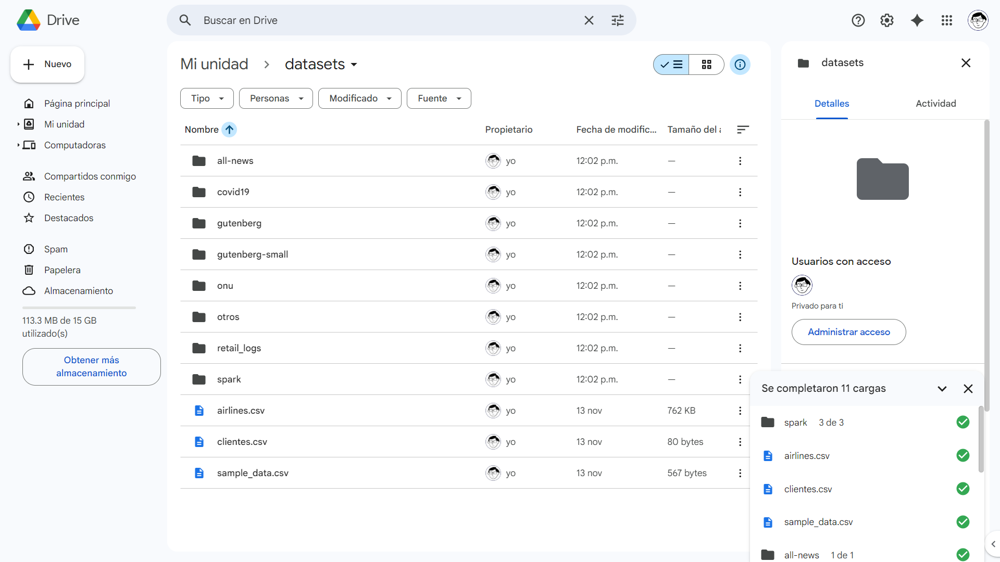
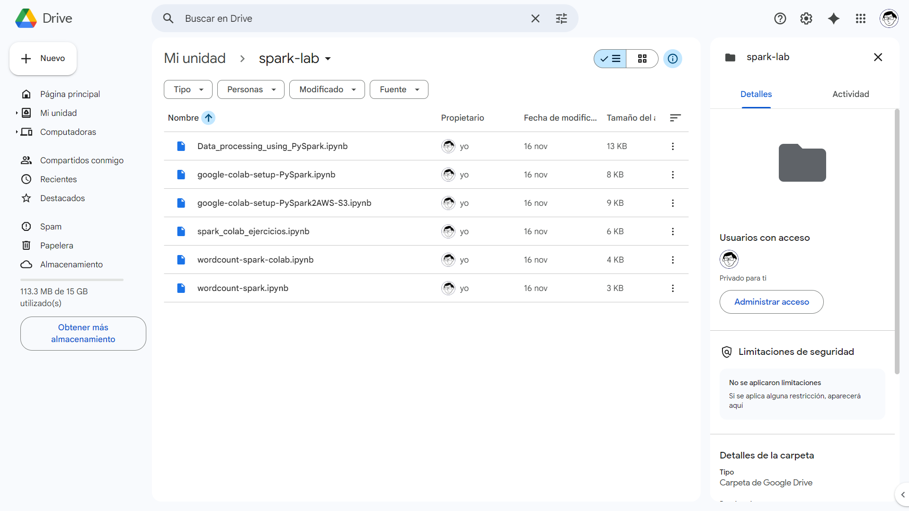
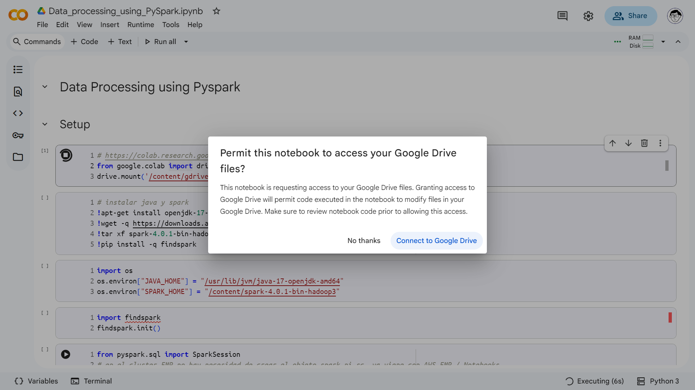
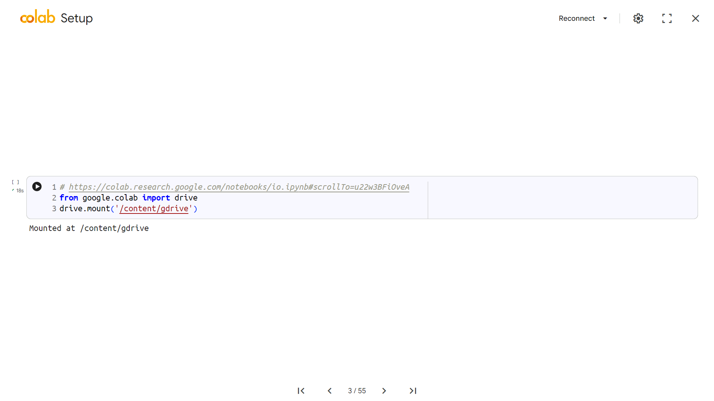

# Laboratorio 4: Usando Apache Spark

## Resumen tabular de ejecución de cuadernos

| Cuaderno | Ambiente | Fuente de datos | Evidencia |
|:--|:--|---|:--|
| Data_processing_using_PySpark | EMR | AWS S3 | [emr-s3.ipynb][1] |
| Data_processing_using_PySpark | Colab | Google Drive | [colab-gdrive.ipynb][2] |

[1]: <notebooks/Data_processing_using_PySpark/emr-s3.ipynb>
[2]: <notebooks/Data_processing_using_PySpark/colab-gdrive.ipynb>

> [!TIP]
>
> Para ver los archivos de salida generados durante la ejecución de los cuadernos
> en el ambiente de Google Colab, puede acceder
> [al directorio `spark-lab/out` en Google Drive](https://drive.google.com/drive/folders/1bGS_NmMgFfD_NDDIoAr3Q5r20dPeqsoZ?usp=sharing).

## Configuración de Google Colab

### Cargando los datasets

### Cargando los cuadernos

### Dando acceso

### Verificación

